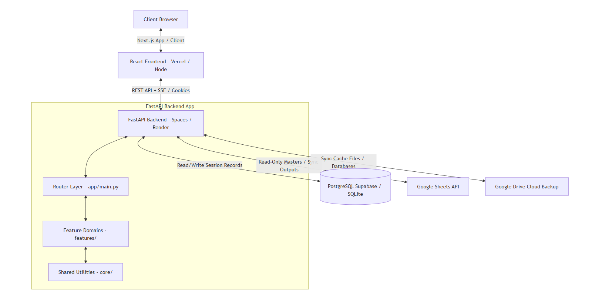

# System Architecture & Technical Specifications

This document describes the high-level architecture, module decomposition, request lifecycle, authentication mechanisms, and background worker systems of the Demand Planning & Forecasting Suite.

---

## 1. System Topology & Data Flow

The application is built on a split-monorepo design, combining a stateless React SPA (Single Page Application) frontend with a FastAPI microservice backend connected to dual data persistence layers:



---

## 2. Codebase Directory Map

### Backend Directory Layout
The backend application has been modularized by feature domain:
- **`app/`**: Handles the bootstrapping and initialization of the FastAPI application.
  - `main.py` is the entrypoint. It constructs the `FastAPI` instance, mounts the CORS middleware, sets up exception handlers, and mounts routers for all features.
  - `config.py` is the centralized environment manager. It extracts configurations, loads `.env` profiles, and maps spreadsheet IDs and sheet keys.
  - `dependencies.py` declares the authentication dependencies and database session contexts injected into routes.
- **`core/`**: Platform infrastructure modules shared by multiple features.
  - `database/`: Declares SQLAlchemy models (`models.py`) and connection engines (`engine.py`).
  - `security/`: Handles JWT token encoding/decoding (`auth_tokens.py`) and Role-Based Access Control permissions (`permissions.py`).
  - `storage/`: Cloud storage provider abstractions (`local.py`, `drive.py`, `supabase.py`) managed by a provider factory.
  - `shared/`: Shared services including Google Sheets client integration (`google_sheets.py`), cache management (`sheets_cache.py`), in-memory caches (`api_cache.py`), and email dispatches (`email.py`).
- **`features/`**: Modular packages representing self-contained business pages/features.
  - Each package is a standalone domain folder containing `router.py` (controllers), and sub-modules handling its specialized business logic (e.g. `product_launch/core.py`, `autopilot/optimized.py`, etc.).
  - Features include: `auth`, `product_launch`, `baseline`, `autopilot`, `dashboard`, `final_plan`, `validation`, `settings`, `insights`, and `master_data`.

---

## 3. Authentication & Session Lifecycles

### Token Exchange and Impersonation
The application employs stateless JSON Web Tokens (JWT) for request authentication.

```
1. Client POST /api/auth/login with credentials.
2. Server validates password hash against database users table.
3. Server creates an entry in the auth_sessions table containing system details (OS, Browser, IP).
4. Server generates JWT containing sub (user_id), username, role, and expiration times.
5. Server writes the JWT to a secure HttpOnly, SameSite=Lax cookie named "ps_auth".
6. Client subsequently attaches this cookie automatically on REST API queries.
```

### Role-Based Access Control (RBAC)
User permissions are verified on routes using dependency injection helpers declared in [`app/dependencies.py`](file:///c:/Users/sumitkumar.nayak/Desktop/forecast-pipeline-v2/backend/app/dependencies.py):

* **`get_current_user`**: Validates the JWT cookie signature and extracts user metadata. Any active account can query.
* **`require_write`**: Elevates check to ensure user has `write` scope (Admin, Planner, or Product roles). Raised `403 Forbidden` if role is Viewer.
* **`require_approve`**: Restricts actions exclusively to users with `approve` scope (Admin role only). Used on baseline approvals or settings adjustments.

---

## 4. Asynchronous Pipeline & SSE

### The Multi-Threaded Auto-Pilot Pipeline
When a user launches the Auto-Pilot weekly process (`POST /api/autopilot/run`), the execution occurs asynchronously to prevent HTTP timeouts:

1. **Thread Spawning**: The router spawns a background thread running `run_optimized_autopilot()` inside `features/autopilot/optimized.py`.
2. **State Store**: The thread records the execution parameters in a global dictionary store (`features/autopilot/state.py`) indexed by a task UUID.
3. **Step Log Tracking**: As each of the 6 steps executes, the step status (`running`, `success`, `failed`), progress logs, and execution errors are written to the database in the `pipeline_step_logs` table.

### Server-Sent Events (SSE) Interface
The frontend client subscribes to progress events in real-time by opening a persistent HTTP connection to:
```http
GET /api/autopilot/stream/{task_id}
Accept: text/event-stream
```
The FastAPI backend uses an SSE generator yielding line-buffered JSON strings representing step events (`event: step`, `event: completed`, `event: failed`). This allows the React client to display live progress bars, terminal logs, and execution times without polling the database.
