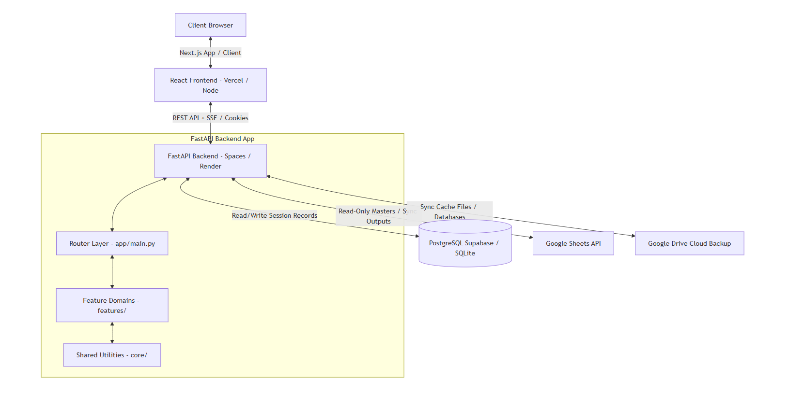

# System Architecture & Technical Specifications

This document describes the high-level architecture, module decomposition, request lifecycle, authentication mechanisms, and background worker systems of the Demand Planning & Forecasting workbench.

---

## 1. System Topology & Data Flow

The application is built on a split-monorepo design, combining a stateless Next.js React SPA (Single Page Application) frontend with a FastAPI microservice backend connected to dual data persistence layers (Google Sheets and SQLite/PostgreSQL databases):



---

## 2. Codebase Directory Map

### Frontend Directory Layout
The frontend application is built with Next.js (App Router), utilizing Tailwind CSS and TypeScript:
- **`src/app/`**: The App Router pages and API routes.
  - Features include: `dashboard`, `baseline` (steps 1–5), `master-data`, `new-product-launch`, `hub-launch`, `final-plan`, `validation`, `settings`, `analytics`, and `admin`.
  - Also contains global layouts (`layout.tsx`), global CSS (`globals.css`), and context providers (`providers.tsx`).
- **`src/components/`**: Modular UI components grouped by feature area:
  - `ui/`: Shared base UI components (buttons, dialogs, cards, etc.).
  - `layout/`: App Shell, sidebar, and navbar components.
  - Feature-specific UI: `analytics/`, `baseline/`, `charts/`, `npl/`, `settings/`, `validation/`.
- **`src/context/`**: React contexts for state management:
  - `AuthContext.tsx` handles authentication states and user sessions.
  - `NplContext.tsx` handles state for the New Product Launch wizard.
- **`src/hooks/`**: Custom React hooks:
  - `useAuth.ts`, `useCachedQuery.ts` (cached data fetching), `useStaleFetch.ts` (SWR-like fetching), and `useInstantBootstrap.ts`.
- **`src/lib/`**: Frontend utility and API client libraries:
  - `api.ts`: Centralized fetch client with authorization headers and automatic error handling.
  - Feature utilities: `auth.ts`, `navigation.ts`, `nplBootstrap.ts`, `pagePrefetch.ts`, `theme.tsx`, `userGuide.ts`.

### Backend Directory Layout
The backend application has been modularized by feature domain:
- **`app/`**: Handles the bootstrapping and initialization of the FastAPI application.
  - `main.py` is the entrypoint. It constructs the `FastAPI` instance, configures CORS/lifespan handlers, sets up exception handlers, and mounts feature routers.
  - `config.py` is the centralized environment manager. It extracts configurations, loads `.env` profiles, and maps spreadsheet IDs and sheet keys.
  - `dependencies.py` declares the authentication dependencies and database session contexts injected into routes.
  - `logging.py`, `middleware.py`, `production.py`, `rate_limit.py` handle cross-cutting backend concerns.
- **`core/`**: Platform infrastructure modules shared by multiple features:
  - `database/`: Declares SQLAlchemy models (`models.py`) and connection engines (`engine.py`).
  - `security/`: Handles JWT token encoding/decoding (`tokens.py`), role/permission definitions (`permissions.py`), and authentication cookie handlers (`auth_cookies.py`, `auth.py`).
  - `storage/`: Cloud and local storage provider abstractions (`local.py`, `drive.py`, `supabase.py`) managed by a provider factory (`factory.py`) with synchronization helpers (`sync.py`).
  - `shared/`: Shared services including Google Sheets client integration (`google_sheets.py`), cache management (`sheets_cache.py`), in-memory caches (`api_cache.py`), email dispatches (`email.py`), system monitoring details (`system_details.py`), and system alerts/notifications (`workflow_notifications.py`).
  - `queue/`: Database-backed task queue drivers (`driver.py`) and workers (`worker.py`) for processing deferred jobs in background threads.
  - `utils/`: Dataframe parsing helpers (`dataframe.py`) and session stores (`session_store.py`).
- **`features/`**: Modular packages representing self-contained business pages/features:
  - Each package is a standalone domain folder containing `router.py` (controllers), and sub-modules handling its specialized business logic (e.g., `product_launch/core.py`, etc.).
  - Features include:
    - `auth`: Credentials verification and session token management.
    - `dashboard`: Main business overview metrics and aggregations.
    - `master_data`: Google Sheets master configurations, metadata, and tables sync.
    - `baseline`: Load raw data, configure parameters, generate baseline, review baseline, and approve baseline actions.
    - `final_plan`: Consensus and final submission processing.
    - `product_launch`: Wizard for submitting new product launch configurations, tracking master mappings, and watching for changes.
    - `hub_launch`: Handles new hub mapping cloning and syncing.
    - `insights`: Discovers and compiles forecasting anomalies or product gaps.
    - `settings`: System configurations, user profiles, and SMTP/recipient preferences.
    - `validation`: Data integrity checks and data-sync validation checks.
    - `shared`: Houses general routers and sub-modules (e.g. `demo_filter_router.py`).

---

## 3. Authentication & Session Lifecycles

### Token Exchange and Impersonation
The application employs stateless JSON Web Tokens (JWT) for request authentication.

```
1. Client POST /api/auth/login with credentials.
2. Server validates password hash against database users table.
3. Server creates an entry in the auth_sessions table containing system details (OS, Browser, IP).
4. Server generates JWT containing sub (user_id), username, role, and expiration times.
5. Server writes the JWT to a secure HttpOnly, SameSite=Lax cookie named "ps_auth".
6. Client subsequently attaches this cookie automatically on REST API queries.
```

### Role-Based Access Control (RBAC)
User permissions are verified on routes using dependency injection helpers declared in [`app/dependencies.py`](file:///c:/Users/sumitkumar.nayak/Desktop/forecast-pipeline-v2/backend/app/dependencies.py):

* **`get_current_user`**: Validates the JWT cookie signature, checks signature validity, and extracts user metadata. Any active account can query.
* **`require_write`**: Elevates check to ensure user has `write` scope (Admin, Planner, or Product roles). Raises `403 Forbidden` if role is Viewer.
* **`require_approve`**: Restricts actions exclusively to users with `approve` scope (Admin role only). Used on baseline approvals or settings adjustments.
* **`require_admin`**: Restricts actions exclusively to administrators (e.g. managing users, system-level updates).

#### Role Scopes Definition
The system maps operations according to the following scopes (configured via `USER_ROLES` in `backend/app/config.py` and enforced via `backend/core/security/permissions.py`):

| Role | Allowed Scopes | Description |
| :--- | :--- | :--- |
| **admin** | `read`, `write`, `approve`, `manage_users` | Full access, user administration, baseline approvals, settings modifications. |
| **planner** | `read`, `write` | Manage forecast pipelines, edit parameters, view dashboards. |
| **product** | `read`, `write` | Manage product launches and configuration parameters. |
| **viewer** | `read` | Read-only access to dashboards, master data, and analytics. |


---

## 5. Background Task Queue Worker

For tasks that must run asynchronously but are decoupled from the main HTTP thread pool (such as Google Sheets synchronization and email notifications), the backend runs a lightweight database-backed task queue.

### Architecture & Worker Lifecycle
- The queue is managed by `QueueWorker` (implemented in [`core/queue/worker.py`](file:///c:/Users/sumitkumar.nayak/Desktop/forecast-pipeline-v2/backend/core/queue/worker.py)) and uses the application's central database as the queue store.
- On startup, `app/main.py` registers tasks and spawns a daemon thread (`queue-worker-daemon`) that polls the task table at a configurable interval (default: 2.0 seconds).
- It handles transaction-safe task claiming to prevent duplicate execution across parallel backend threads or processes.

### Registered Queue Tasks
The queue worker handles several critical tasks defined in [`features/product_launch/tasks.py`](file:///c:/Users/sumitkumar.nayak/Desktop/forecast-pipeline-v2/backend/features/product_launch/tasks.py):

* **`npl.send_email`**: Dispatches email notifications to planners and stakeholders when a new product launch is submitted or approved.
* **`npl.sheets_sync`**: Syncs approved product launches to the canonical Google Sheets.
* **`npl.delete_submission_rows`**: Performs batch deletion of rows from product launch spreadsheets.
* **`npl.ph_sync` / `npl.new_hub_sync`**: Copies and appends product-hub combinations to the **P-H Master** worksheet in the background.
