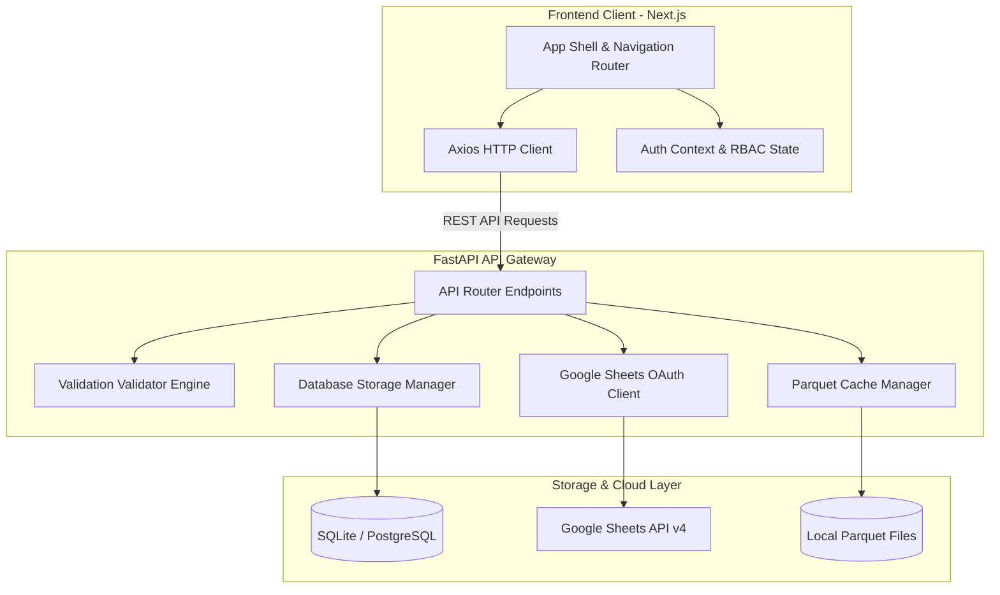
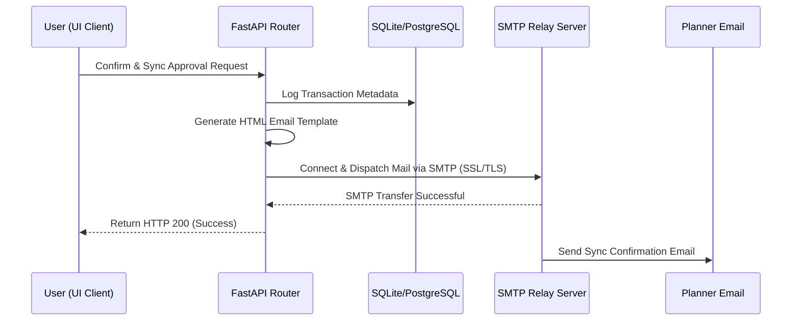
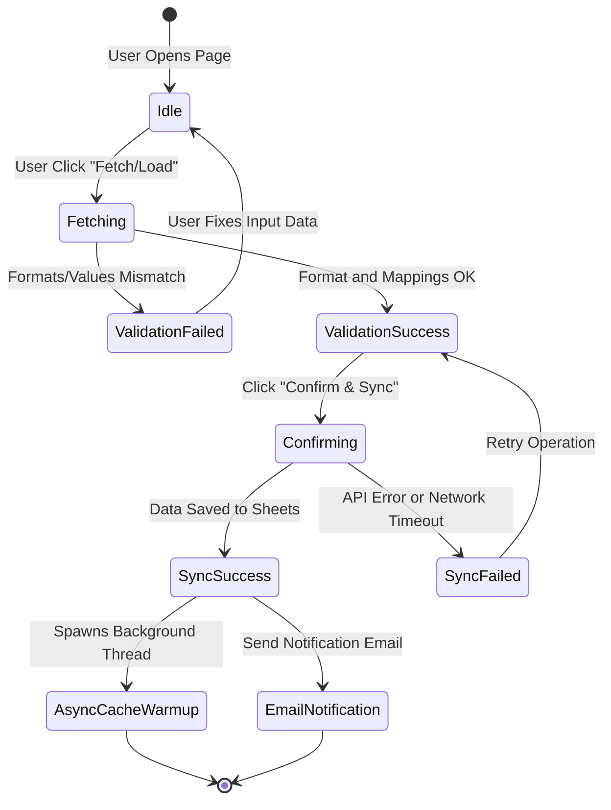
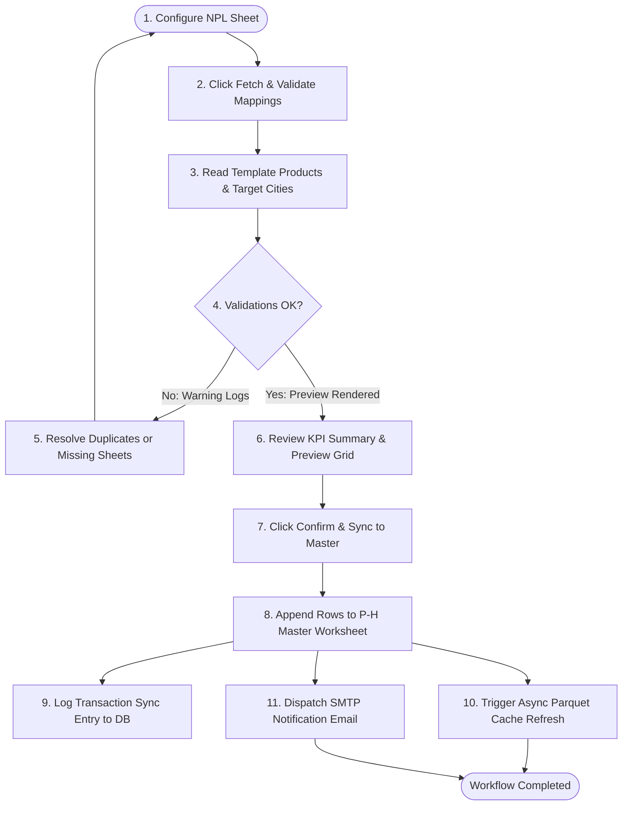
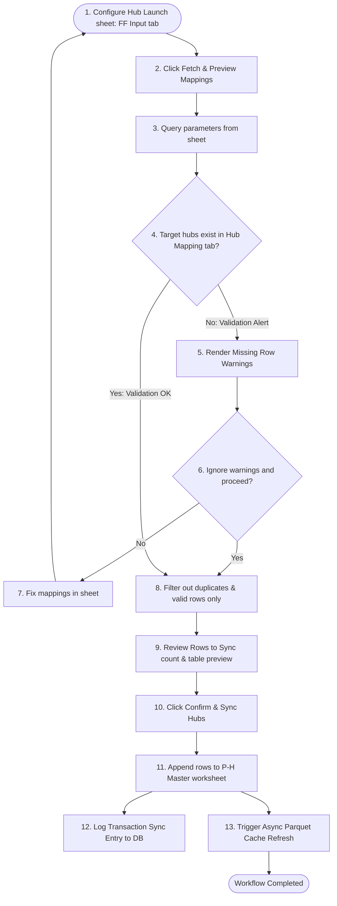

# Demand Planning & Forecast Pipeline Suite: Complete System Guide

This handbook is the single source of truth for the **Demand Planning Suite**. It is designed to onboard new software engineers, assist product managers in coordinating launches, guide business planners in executing forecast cycles, and provide system administrators with deployment details.

---

# PART 1: SYSTEM ARCHITECTURE & DATA FLOWS

This section explains the technical design of the system, data flows, and performance optimization mechanics.

## 1. System Topology & Data Exchange Architecture
The Demand Planning Suite uses a decoupled, high-throughput model designed to handle large-scale database operations and live synchronization with Google Sheets:



* **Frontend**: Next.js App Router, TypeScript, and Vanilla Tailwind CSS. It uses page pre-fetching to ensure instantaneous transitions between views.
* **Backend**: FastAPI (Python), SQLAlchemy, Pandas, and PyArrow. It exposes REST endpoints, runs validation rules, and manages asynchronous background tasks.
* **Database**: Local SQLite for development and PostgreSQL for production. It records sync metadata and execution logs.
* **External Integration**: Google Sheets API v4 (using `gspread` service accounts) serves as the planning database.

---

## 2. High-Performance Caching Layer (Parquet Cache Engine)
To maintain sub-second page loads, the system avoids querying Google Sheets on every page reload by using an optimized local Parquet cache:

* **Caching Reads**: Worksheets are stored locally as `.parquet` files under the backend's outputs directory. The backend reads from these local files, returning data in **less than 100ms**.
* **Automatic Expiry (TTL)**: Cache files expire after a set time limit (e.g. 30 minutes for master data, 5 minutes for parameters). When expired, the next read triggers a fresh fetch from Google Sheets and rebuilds the Parquet file.
* **Asynchronous Cache Warmups**: When write actions are committed (e.g. confirming a Hub Launch sync to the `P-H Master` sheet), the local cache immediately becomes stale. The backend appends the rows to Google Sheets, resolves the user request instantly, and triggers a **detached background thread** to load the fresh sheet and rebuild the Parquet cache file in the background.
* **Startup Cache Pre-Warming**: On server boot, a background thread fetches and creates the Parquet cache files for all critical worksheets (`hub_mapping`, `product_hub_master`, `ff_input`) immediately. This prevents a slow first fetch from exceeding server gateway timeouts.

---

## 3. Automated Email Trigger Workflows
When a critical pipeline stage finishes (such as baseline approvals or product launch sync confirmations), the system triggers automated notification emails:



* **Configuration**: Credentials (`FROM_EMAIL`, `FROM_EMAIL_APP_PASSWORD`) are loaded securely from environment variables.
* **Template Rendering**: Uses dynamic HTML templates displaying statistics (new rows, skipped records, timestamps).
* **Delivery**: Dispatched via standard SMTP over secure ports (e.g., port 465 or 587).

---

## 4. Real-Time FF Input Watcher & Diff Engine (Hub Launch)
To ensure planners are notified immediately when the configuration changes in Google Sheets (without having to reload or sync), the system uses a background daemon thread watcher coupled with a cell-level diff engine:

```mermaid
flowchart TD
    Sheet[Google Sheets: FF Input Tab]
    
    subgraph WatcherDaemon [Watcher Daemon - Thread (every 45s)]
        Read[GSM Read Worksheet Uncached]
        HashCheck{Hash changed?}
        DiffEngine[Composite Diff Engine]
        History[Append VersionEntry to History]
        Email[Send Color-Coded HTML Email]
    end
    
    subgraph ClientPoll [Frontend Client Polling (every 30s)]
        Poll[GET /change-status]
        UIChange{change_detected?}
        Banner[Show Purple Notification Banner]
        View[Expand Version History Panel]
    end

    Sheet -->|Read live rows| Read
    Read --> HashCheck
    HashCheck -->|No| Sleep[Sleep 45s]
    HashCheck -->|Yes| DiffEngine
    DiffEngine --> History
    DiffEngine --> Email
    
    Poll --> UIChange
    UIChange -->|Yes| Banner
    Banner -->|User clicks View| View
    View -->|Loads in-memory version list| UIChange
```

### A. Watcher Daemon Lifecycle (`ff_input_watcher.py`)
* **Startup**: Triggered automatically in the FastAPI `lifespan` startup hook via `start_ff_input_watcher(interval_seconds=45)`.
* **Threading**: Spawns a dedicated daemon thread `ff-input-watcher` that runs continuously in the background. It waits `10s` initially on boot to allow cache warming to finish before polling.
* **Bypassing Cache**: The watcher explicitly uses `use_cache=False` to fetch the live worksheet data directly from the Google Sheets API.
* **State Management**: Stores the watcher status, a rolling buffer of the last `20` change versions, and the `change_detected` flag in an in-memory dictionary. This state is reset on application restart.

### B. Row-Level Identity & Composite Keys
Because rows can be reordered in Google Sheets, index-based comparison is not reliable. Instead, the diff engine builds a composite unique key for each row:
$$\text{Composite Key} = \text{lowercase}(\text{hub\_name}) \mathbin{\Vert} \text{lowercase}(\text{source\_hub})$$
The columns are looked up using case-insensitive header normalization (`hub_name`/`Hub_name` and `source_hub`/`Source_Hub`).

### C. Diff Calculation Logic (`compute_diff`)
1. **Added Rows**: Mappings whose composite key exists in the new sheet but not in the old snapshot.
2. **Removed Rows**: Mappings whose composite key exists in the old snapshot but not in the new sheet.
3. **Modified Cells**: Mappings whose composite key exists in both, but one or more cell values differ. For modified rows, it tracks:
   * Which specific columns changed (`changed_cells`).
   * The values before and after the change (`before` and `after` value maps).

### D. Version Entry Data Structure
Each history version is saved as a structured JSON object:
```json
{
  "version_id": "v1783669123",
  "detected_at": "2026-07-10T11:22:15Z",
  "summary": "1 added, 2 modified, 1 removed",
  "row_count_before": 58,
  "row_count_after": 58,
  "headers": ["city_name", "Type", "Hub_name", "Hub_id", "Source_Hub", "Percentage", "Start_date", "End_date"],
  "diff": {
    "added": [{"city_name": "NCR", "Type": "New Hub", "Hub_name": "WLS", ...}],
    "removed": [],
    "modified": [
      {
        "key": "agc|ngc",
        "changed_cells": ["Percentage"],
        "before": {"Percentage": "0.5"},
        "after": {"Percentage": "0.32"},
        "row": {"city_name": "NCR", "Type": "New Hub", "Hub_name": "AGC", "Percentage": "0.32", ...}
      }
    ],
    "unchanged_count": 56
  }
}
```

### E. Rich HTML Email Formatting
When a change is detected, `notify_ff_input_changed` renders a custom HTML email featuring:
* A summary table showing row count transitions (`58 → 58 rows`).
* **Color-Coded Tables** representing the diff:
  * **🟢 Green backgrounds** (`#F0FDF4`) for added rows.
  * **🔴 Red backgrounds with strikethrough text** (`#FEF2F2`) for removed rows.
  * **🟡 Yellow backgrounds** (`#FFFBEB`) for modified rows.
  * **Inline Diff markers**: Changed cells render as `[old_value] → [new_value]` with deletions in red strikethrough (`<del style="color:#EF4444">`) and insertions in bold green (`<strong style="color:#16A34A">`).

---

# PART 2: PLATFORM OPERATIONS & RUNBOOK


This section provides page-by-page operational instructions for team members using the application.

## 1. User Roles & Permission Matrix
The system uses Role-Based Access Control (RBAC) to restrict action permissions depending on user profiles:

* **Administrator (`admin`)**: Can execute manual and autopilot baseline pipelines, modify settings, manage users, and confirm master spreadsheet syncs.
* **Planner (`planner`)**: Can run autopilot scripts, execute manual baseline steps 1-5, review forecasts, and confirm new Hub launches.
* **Product Manager (`product`)**: Access is restricted to the **Product Launch (NPL)** module. Can fetch, preview, and sync new product configurations. All baseline operations are locked.
* **Viewer (`viewer`)**: Read-only access across the Dashboard, Master Data, and Final Plan pages. All write, update, and sync confirmation buttons are disabled.

---

## 2. Page-by-Page Operational Guide & Transaction State Machine

### A. General Navigation Transitions
The system enforces sequential workflows. If a validation check fails, the user is blocked from proceeding until the input data is corrected.



---

### B. Functional Pipelines: Visual Workflows

This section maps out the operational steps for the core functional tasks in the suite.

#### Workflow 1: New Product Launch (NPL) Sync
Clones template forecast configurations to launch targets.



---

#### Workflow 2: New Hub Launch Sync
Clones ref product mappings to target distribution hubs.



---

### C. Detailed Page Profiles

#### 📊 Dashboard
* **Target Audience**: Planners, Managers, Admins, Viewers.
* **Purpose**: Overview of the forecasting pipeline.
* **Inputs**: Reads system metadata and execution logs from the database.
* **Outputs**: Displays active sync status, data load KPI graphs, and execution history. Check this page to verify that background automation runs completed successfully.
* **State Machine & Branching Logic**:
  * **If Successful**: Dashboard renders green "Connected" status indicators and lists history tables.
  * **If Failed**: Renders red alert banners. The planner should check server logs to debug database connections.

#### ⚡ Auto-Pilot
* **Target Audience**: Planners, Admins.
* **Purpose**: Run the end-to-end forecasting pipeline with a single click.
* **Inputs**: Google Sheets configuration parameters.
* **Outputs**: Updated baseline forecast values written to database tables.
* **State Machine & Branching Logic**:
  * **Start**: User clicks **Run Auto-Pilot**. State transitions to `RUNNING`.
  * **Success Path**: The pipeline completes all steps. State transitions to `COMPLETED` and sends an email notification.
  * **Failure Path**: If any step fails, execution halts. State transitions to `FAILED` and displays the error log.

#### ⚙️ Manual Baseline steps (1 → 5)
Planners can execute baseline steps individually for granular control:

* **Step 1: Load Raw Data**:
  * **Inputs**: Sales history database.
  * **Outputs**: Raw baseline dataset.
  * **Action**: Click *Load Raw Data* to fetch historical actuals.
  * **Next Steps**: If successful, proceed to **Step 2**. If failed (e.g., database timeout), resolve database connection parameters in settings before retrying.
* **Step 2: Configure Parameters**:
  * **Inputs**: Override spreadsheets (growth, seasonality).
  * **Outputs**: Configured baseline parameters.
  * **Action**: Review overrides and click *Confirm Parameters*.
  * **Next Steps**: If successful, proceed to **Step 3**. If invalid parameters are entered, the system highlights the cells; correct them in the parameters sheet before proceeding.
* **Step 3: Generate Baseline**:
  * **Inputs**: Historical data and configuration parameters.
  * **Outputs**: Statistical forecast projection database.
  * **Action**: Click *Generate Forecast* and wait for execution logs.
  * **Next Steps**: If successful, proceed to **Step 4**. If algorithm parameters fail, adjust config values and retry.
* **Step 4: Review & Validate**:
  * **Inputs**: Generated forecast projections.
  * **Outputs**: Validation report flags.
  * **Action**: Review flagged items and confirm data integrity.
  * **Next Steps**: If adjustments are needed, revert to **Step 2** to update parameters. If approved, proceed to **Step 5**.
* **Step 5: Approve Baseline**:
  * **Inputs**: Confirmed forecast projections.
  * **Outputs**: Promoted baseline database records.
  * **Action**: Click *Approve and Promote* to unlock the **Final Plan** tab.
  * **Next Steps**: Triggers an automated notification email to the planning team. Unlocks read access on the **Final Plan** page.

#### 📦 Product Launch (NPL)
* **Target Audience**: Admins, Planners, Product Managers.
* **Purpose**: Launch new SKUs by cloning reference parameters from templates to target cities.
* **Inputs**: Template mappings configured in the NPL configuration Google Sheet.
* **Outputs**: New configuration rows appended to the `P-H Master` sheet.
* **State Machine & Branching Logic**:
  * **Start**: User clicks **Fetch & Validate Product Mappings**.
  * **Validation Path**: If missing columns are found, the UI blocks the confirm step. If mappings are valid, the preview table is rendered.
  * **Sync Path**: User clicks **Confirm & Sync**. On success, the backend sends a confirmation email and starts the background cache warmup.

#### 🔌 Hub Launch
* **Target Audience**: Admins, Planners, Product Managers.
* **Purpose**: Configure newly launched distribution hubs by cloning product configuration settings from existing reference hubs.
* **Inputs**: Target hub codes and source reference codes configured in the **FF Input** tab of the Hub Launch spreadsheet.
* **Outputs**: Cloned forecast parameters appended to the `P-H Master` sheet.
* **State Machine & Operational Flow**:
  1. **Immediate Load (Preview Ready)**: On mounting, the page directly renders the **FF Input Sheet** table. There is no idle state. The **Preview Sync** and **Sync to P-H Master** buttons are immediately visible.
  2. **Active Watcher Alerts**: The client automatically polls `/api/new-product-launch/sync-new-hub/change-status` every **30 seconds**.
     * **If a change is detected**: A purple alert banner is displayed immediately. Planners can click **View Version History** to see exactly what changed, or **Dismiss** to hide the alert.
     * **Dismissing**: Pings `/api/new-product-launch/sync-new-hub/dismiss-changes` to clear the flag.
  3. **Version History Timeline**: An expandable accordion panel. It displays a timeline of the last 20 commits with a vertical rail:
     * Glowing **purple node** for the latest version, grey nodes for older ones.
     * Expansion reveals a Google Sheets-style diff table: green rows represent insertions (`+`), red rows represent deletions (`-`), and yellow cells show modified cells with `old_value → new_value`.
  4. **Sync Operation**:
     * **Preview**: User clicks **Preview Sync** to compute insertion candidates (validates that target hubs exist in the `Hub Mapping` configurations). If validation issues exist, warnings are printed.
     * **Sync Confirmation**: Clicking **Sync to P-H Master** clones parameters, writes them to `P-H Master` in Google Sheets, records the log in database tables, and refreshes the cache.


#### 📋 Final Plan
* **Target Audience**: Admins, Planners.
* **Purpose**: Displays final forecasting reports. Locked until the active baseline is approved in step 5.
* **Inputs**: Approved baseline projections.
* **Outputs**: Read-only validation summaries and CSV export configurations.

#### ⚙️ Settings
* **Target Audience**: All Roles.
* **Purpose**: Central system configuration profiles manager.
* **Sub-Sections (Tabs)**:
  1. **Profile**: Displays user authentication data (full name, centralized email address, and active role status). Updates are centrally managed.
  2. **Preferences**: Allows switching local behaviors (e.g., toggling live automated email alerts, toggling automatic master configurations loads, and limiting table rows counts previews).
  3. **Users (Admin Only)**: Allows admins to create new users, manage existing planner accounts, and delete inactive profiles.
  4. **Email Config**: Shows SMTP status (Configured/Not Configured), allows sending test emails to validated planners, managing target recipient subscriber lists, and viewing raw transactional email logs.
  5. **Session**: Exposes browser client metadata (timezone, platform resolution) alongside live backend API server system statistics.
  6. **About**: Renders developer metadata, framework versions (FastAPI, Next.js), active database engines, and environment check statuses.

---

# PART 3: DOCKER & CONTAINER DEPLOYMENT DESIGN

The analytical engine is fully containerized to ensure consistent execution environments between development and production space environments.

## 1. Dockerfile Walkthrough & Explanations
Here is the production Dockerfile (`Dockerfile`) used to build our backend image:

```dockerfile
# Planning Suite API — Hugging Face Spaces (Docker SDK) at root
FROM python:3.12-slim-bookworm

ENV PYTHONDONTWRITEBYTECODE=1 \
    PYTHONUNBUFFERED=1 \
    PIP_NO_CACHE_DIR=1 \
    PORT=7860 \
    APP_ENV=production

WORKDIR /app

# System libraries: Postgres (psycopg2), build tools, R runtime (pyreadr / 6w RDS)
RUN apt-get update && apt-get install -y --no-install-recommends \
    build-essential \
    libpq-dev \
    curl \
    r-base-core \
    && rm -rf /var/lib/apt/lists/*

COPY backend/requirements.txt .
RUN pip install --upgrade pip && pip install -r requirements.txt

COPY backend/app ./app
COPY backend/src ./src
COPY backend/scripts ./scripts

# Writable artifact dirs (synced from Google Drive at startup when STORAGE_BACKEND=drive)
RUN mkdir -p data/outputs/sheets_cache data/outputs/cache data/masters data/dp_logics data/analytics data/ff_inputs data/raw_actuals

COPY backend/docker-entrypoint.sh /docker-entrypoint.sh
RUN chmod +x /docker-entrypoint.sh

EXPOSE 7860

HEALTHCHECK --interval=30s --timeout=10s --start-period=90s --retries=3 \
  CMD curl -fsS "http://127.0.0.1:${PORT}/api/health" || exit 1

ENTRYPOINT ["/docker-entrypoint.sh"]
```

### Explanations of Key Docker Instructions:
* **`FROM python:3.12-slim-bookworm`**: Uses a lightweight, secure base image to minimize container size.
* **`r-base-core`**: Installs R binaries required for analytical libraries (e.g. `pyreadr` RDS database parsing).
* **`mkdir -p data/...`**: Creates directories with write permissions for saving local cached Parquet files.
* **`docker-entrypoint.sh`**: Initializes database migrations, checks environment credentials, and starts the Uvicorn production server process.

---

# PART 4: LOCAL DEVELOPMENT & TESTING

Follow these steps to run and test the application on your local machine.

## 1. Backend Setup
1. Navigate to the backend directory:
   ```bash
   cd backend
   ```
2. Create and activate a Python virtual environment:
   ```bash
   python -m venv venv
   # On Windows:
   venv\Scripts\activate
   # On macOS/Linux:
   source venv/bin/activate
   ```
3. Install dependencies:
   ```bash
   pip install -r requirements.txt
   ```
4. Create a `.env` file in the `backend` folder:
   ```env
   DATABASE_URL=sqlite:///forecasting_db.sqlite
   GOOGLE_CREDENTIALS_JSON={"type": "service_account", ...}
   NEW_HUB_LAUNCH_SHEET_URL=https://docs.google.com/spreadsheets/d/1ZraxKQ-oJPrIablGSaMffTBQiJSx9us7omj8yG3etVM/edit
   ```
5. Run the development server:
   ```bash
   uvicorn app.main:app --reload --port 8000
   ```

## 2. Frontend Setup
1. Navigate to the frontend directory:
   ```bash
   cd frontend
   ```
2. Install npm dependencies:
   ```bash
   npm install
   ```
3. Create a `.env.local` file:
   ```env
   NEXT_PUBLIC_API_URL=http://localhost:8000
   ```
4. Start the Next.js development server:
   ```bash
   npm run dev
   ```
5. Open [http://localhost:3000](http://localhost:3000) in your browser.

## 3. Run Sync Simulations Locally
To test the preview parser and check validation rules offline:
```bash
$env:PYTHONPATH="src"
python scratch/inspect_new_hub_preview.py
```
This saves the preview results directly to `scratch/preview_output.json`.
