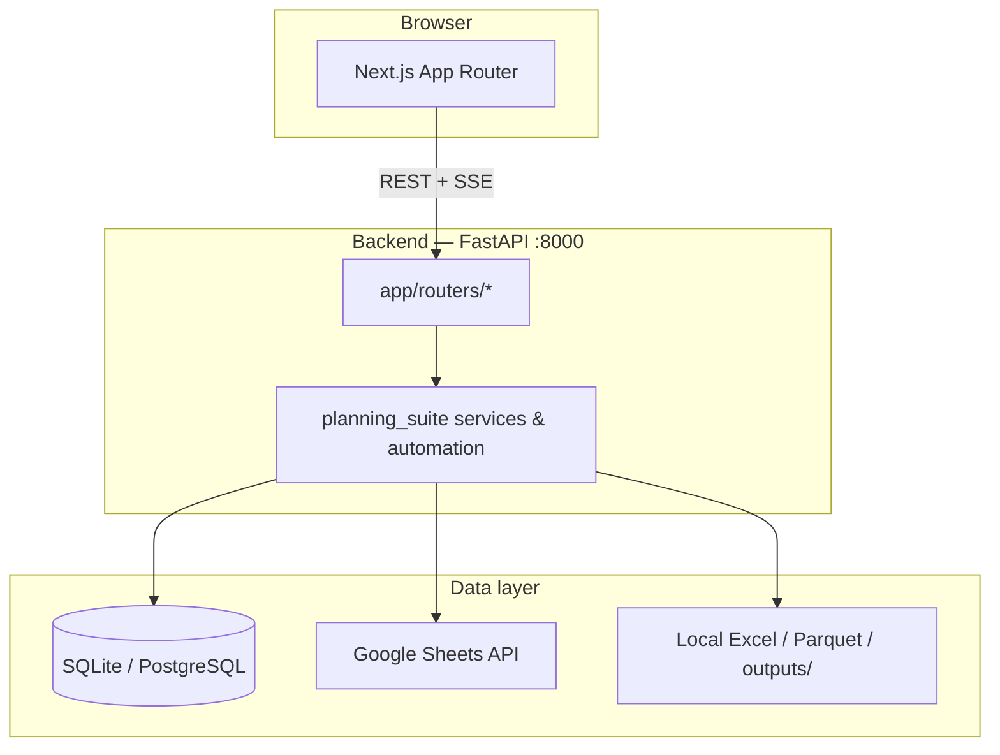

# Planning Suite — Developer Guide

**Forecast Pipeline V2** is a full-stack demand planning and forecasting application. It connects Google Sheets master data, local Excel/Parquet pipelines, and a PostgreSQL or SQLite database to support weekly baseline generation, final plan execution, product launches, validation, analytics, and operational notifications.

This document is the primary onboarding reference for engineers joining the project. It covers architecture, setup, configuration, domain workflows, API surface, frontend patterns, testing, and extension guidelines.

---

## Table of contents

1. [Product overview](#1-product-overview)
2. [Architecture](#2-architecture)
3. [Repository layout](#3-repository-layout)
4. [Prerequisites](#4-prerequisites)
5. [Local development setup](#5-local-development-setup)
6. [Environment configuration](#6-environment-configuration)
7. [Authentication and authorization](#7-authentication-and-authorization)
8. [Database](#8-database)
9. [External integrations](#9-external-integrations)
10. [Core domain workflows](#10-core-domain-workflows)
11. [API reference (by domain)](#11-api-reference-by-domain)
12. [Frontend architecture](#12-frontend-architecture)
13. [Caching and performance](#13-caching-and-performance)
14. [Email notifications](#14-email-notifications)
15. [CLI scripts and background jobs](#15-cli-scripts-and-background-jobs)
16. [Testing](#16-testing)
17. [Production deployment notes](#17-production-deployment-notes)
18. [Troubleshooting](#18-troubleshooting)
19. [Extending the application](#19-extending-the-application)

---

## 1. Product overview

### What the system does

Planning Suite orchestrates a recurring **weekly demand planning cycle**:

| Phase | Purpose |
|-------|---------|
| **Master data** | Sync product, product-hub, hub mapping, and inventory buffer sheets from Google Sheets into local Excel and validated caches |
| **Raw data** | Pull weekly sales actuals (RDS / Trino / bulk sources) into `outputs/active_dataset.parquet` |
| **Baseline** | Run the baseline forecasting engine; produce Summary Excel outputs for review |
| **Approval** | Admin locks the approved baseline, unlocking Final Plan |
| **Final plan** | Merge festive/adhoc/inventory inputs and run the final plan engine |
| **Launch ops** | New product launch wizard, P-H Master sync, hub launch workflows |
| **Validation** | Pandera/schema checks on inputs, masters, and engine outputs |
| **Analytics** | 6-week rolling insights, revenue trends, RCA/pareto views, downloadable reports |
| **Auto-Pilot** | Headless 6-step automation that runs the full baseline path asynchronously |

### User roles

| Role | Capabilities |
|------|--------------|
| **admin** | Full read/write, baseline approval, user management, email recipient CRUD, all pages |
| **planner** | Read/write on operational pages; cannot approve baseline or manage admin-only settings |
| **viewer** | Read-only access to Dashboard, Master Data, Analytics, Settings |

### Application pages (frontend routes)

| Route | Description |
|-------|-------------|
| `/dashboard` | Pipeline status, week KPIs, delta tables, revenue trends |
| `/autopilot` | Run and monitor the 6-step Auto-Pilot with live SSE updates |
| `/baseline/*` | Manual baseline steps 1–5 (load raw → configure → generate → review → approve) |
| `/master-data` | P Master, P-H Master, Hub Master, inventory buffer, sync history, rollback |
| `/new-product-launch` | NPL wizard, P-H sync, auto-sync, submission history |
| `/final-plan` | Final plan inputs, sync, run engine (unlocked after baseline approval) |
| `/validation` | Upload validation, master checks, baseline/final-plan output validation |
| `/analytics` | Insights and Reports tabs |
| `/settings` | Profile, preferences, email recipients, session details, about |

---

## 2. Architecture

### High-level diagram



### Design principles

- **Thin API layer**: `backend/app/` only handles HTTP, auth, serialization, and background task wiring.
- **Domain logic in `planning_suite`**: Business rules, sheet I/O, engines, validation, and notifications live under `backend/src/planning_suite/`.
- **Decoupled frontend**: Next.js communicates exclusively via REST and Server-Sent Events (SSE). No server-side rendering of pipeline logic.
- **Shared database singleton**: One `Database` instance per process (`get_shared_database()`) for cache coherence and long-running Auto-Pilot jobs.

### Tech stack

| Layer | Technology |
|-------|------------|
| Frontend | Next.js 16, React 19, TypeScript, Tailwind CSS, Recharts, Axios |
| Backend | FastAPI, Uvicorn, SSE-Starlette, PyJWT, Pydantic |
| Data processing | pandas, polars, pyarrow, openpyxl, pandera |
| Google | gspread, google-auth, service account JSON |
| Email | redmail (SMTP) |
| Database | SQLAlchemy 2; SQLite (default) or PostgreSQL (Supabase) |
| Testing | pytest, FastAPI TestClient |

---

## 3. Repository layout

```
forecast-pipeline-v2/
├── DEVELOPER_GUIDE.md          ← this document
├── README.md                   ← quick start
├── start_all.sh                ← bash helper to run both servers
│
├── backend/
│   ├── app/
│   │   ├── main.py             ← FastAPI app, CORS, router registration
│   │   ├── deps.py             ← JWT auth, DB dependency, role guards
│   │   └── routers/            ← one module per API domain
│   ├── src/planning_suite/     ← core business logic
│   │   ├── config.py           ← paths, sheet URLs, env loading
│   │   ├── db/                 ← SQLAlchemy models + Database engine
│   │   ├── core/               ← auth, permissions, validations
│   │   ├── services/           ← domain services (sheets, baseline, email, …)
│   │   ├── automation/         ← Auto-Pilot, master sync runners
│   │   └── features/           ← product launch feature module
│   ├── scripts/                ← CLI entry points (autopilot, hub automation)
│   ├── tests/                  ← pytest suite
│   ├── outputs/                ← runtime artifacts (parquet, caches, state JSON)
│   ├── .env                    ← secrets and paths (not committed)
│   ├── requirements.txt
│   └── run_backend.py          ← uvicorn entry point
│
└── frontend/
    ├── src/
    │   ├── app/                  ← Next.js App Router pages
    │   ├── components/         ← layout, charts, NPL wizard, validation UI
    │   ├── hooks/              ← useAuth, useCachedQuery, useInstantBootstrap
    │   └── lib/                ← api client, auth, navigation, caches
    ├── next.config.ts          ← API rewrite proxy
    └── package.json
```

### Key backend modules

| Module | Responsibility |
|--------|----------------|
| `planning_suite.config` | All environment paths and Google Sheet URLs |
| `planning_suite.db.engine` | CRUD, migrations/init, run logging, email log |
| `planning_suite.services.google_sheets` | Low-level sheet read/write with caching |
| `planning_suite.services.sheets_cache` | Parquet-backed sheet cache |
| `planning_suite.automation.optimized_autopilot` | 6-step Auto-Pilot runner |
| `planning_suite.automation.master_data_sync` | Master sheet → Excel export |
| `planning_suite.services.email_service` | SMTP send + email_log persistence |
| `planning_suite.services.pipeline_flow` | 7-step pipeline readiness checks |
| `planning_suite.services.baseline_manual` | Manual baseline step operations |
| `planning_suite.services.final_plan_engine` | Final plan engine trigger |
| `planning_suite.features.new_product_launch` | NPL validation and sync |

### Key frontend modules

| Module | Responsibility |
|--------|----------------|
| `lib/api.ts` | Axios client, JWT interceptor, long-timeout client for heavy sheets |
| `lib/navigation.ts` | Sidebar structure, RBAC route map, baseline step metadata |
| `lib/bootstrapCache.ts` | sessionStorage stale-while-revalidate helpers |
| `lib/pagePrefetch.ts` | Hover/idle prefetch of page bootstrap data |
| `lib/queryCache.ts` | In-memory + sessionStorage query cache |
| `components/layout/AppShell.tsx` | Page shell, auth gate, route prefetch on login |
| `hooks/useAuth.ts` | User/role hydration from localStorage |

---

## 4. Prerequisites

### Software

- **Python 3.11+** (3.14 tested in CI/dev)
- **Node.js 20+** and npm
- **Google Cloud service account** with access to planning spreadsheets
- **Network access** to Google Sheets API and (if used) Supabase PostgreSQL, Trino/RDS data sources

### Files and mounts

The backend expects several **local folders and files** referenced in `.env`:

- Google service account JSON
- Mounted drive root (`PLANNING_DRIVE_ROOT`) containing 6-week CSV/RData sources
- Writable `backend/outputs/` directory for parquet caches and run state

---

## 5. Local development setup

### Backend

```bash
cd backend
python -m venv .venv

# Windows
.venv\Scripts\activate

# macOS / Linux
source .venv/bin/activate

pip install -r requirements.txt
python run_backend.py
```

- API: **http://localhost:8000**
- Swagger UI: **http://localhost:8000/docs**
- Health check: **GET /api/health**

On startup, `main.py` lifespan hook calls `Database.init_database()` to ensure tables exist.

### Frontend

```bash
cd frontend
npm install
npm run dev
```

- UI: **http://localhost:3000**
- Default API target: `http://localhost:8000` (override with `NEXT_PUBLIC_API_URL`)

### Run both (Linux/macOS)

```bash
./start_all.sh
```

On Windows, run backend and frontend in separate terminals.

### First login

Users are stored in the database (`users` table). Seed or create an admin user through your team's standard provisioning process. Login endpoint: `POST /api/auth/login` with `{ username, password, remember_me? }`.

---

## 6. Environment configuration

Create `backend/.env`. All path variables marked **required** must exist or `planning_suite.config` raises at import time.

### Authentication

| Variable | Required | Description |
|----------|----------|-------------|
| `AUTH_SECRET_KEY` | Production | JWT signing secret. Generate: `python -c "import secrets; print(secrets.token_hex(32))"` |
| `AUTH_COOKIE_DAYS` | No | Token lifetime when "remember me" is checked (default `7`) |
| `AUTH_COOKIE_NAME` | No | Cookie name if cookie auth is used (default `ps_auth`) |
| `APP_ENV` | No | `development` or `production`. Production requires `AUTH_SECRET_KEY` |

### Database

| Variable | Required | Description |
|----------|----------|-------------|
| `DATABASE_URL` | No | PostgreSQL connection string (Supabase). Omit to use SQLite at `backend/forecasting_db.sqlite` |

### Google Sheets

| Variable | Required | Description |
|----------|----------|-------------|
| `GOOGLE_CREDENTIALS_PATH` | Yes | Path to service account JSON |
| `PLANNING_DRIVE_ROOT` | Yes | Root mount for planning data files |
| `HUB_LEVEL_PLANNING_SHEET_URL` | Yes | Hub-level planning workbook |
| `NEW_HUB_LAUNCH_SHEET_URL` | Yes | New hub launch workbook |
| `DEMAND_PLANNING_MASTERS_SHEET_URL` | Yes | P Master, P-H Master, Hub Mapping, etc. |
| `CLUSTER_MASTER_SHEET_URL` | Yes | Cluster mapping |
| `AVAILABILITY_LOSS_SHEET_URL` | Yes | Availability-led revenue loss |
| `DP_LOGICS_SHEET_URL` | Yes | DP Logics parameters |
| `VALIDATION_SHEET_URL` | Yes | Validation rules sheet |
| `EA_TRACKER_SHEET_URL` | Yes | EA tracker |
| `INVENTORY_BUFFER_SHEET_URL` | Yes | Inventory buffer logic |
| `PIPELINE_PARAMS_SHEET_URL` | No | Pipeline params (Variables + Hub_Changes tabs) |
| `PIPELINE_PARAMS_VARIABLES_TAB` | No | Default `Variables` |
| `PIPELINE_PARAMS_HUB_CHANGES_TAB` | No | Default `Hub_Changes` |

### Local pipeline paths

| Variable | Required | Description |
|----------|----------|-------------|
| `RAW_DATA_PATH` | Yes | Raw actuals source folder |
| `RDS_6W_PATH` | Yes | Path to `.RData` for 6-week rolling cache |
| `BASELINE_OUTPUTS_FOLDER` | Yes | Baseline engine output directory |
| `FF_INPUTS_FOLDER` | Yes | Final plan input Excel folder |
| `FF_INV_LOGIC_FOLDER` | Yes | Inventory logic Excel folder |
| `FF_MASTERS_XLSX` | Yes | Local `Product_Masters.xlsx` path |
| `RAW_ACTUALS_FOLDER` | Yes | Raw actuals working folder |
| `DP_LOGICS_FOLDER` | Yes | Synced DP Logics Excel folder |

### Email (SMTP)

| Variable | Required | Description |
|----------|----------|-------------|
| `FROM_EMAIL` | For email | Sender address (Gmail/Workspace) |
| `FROM_EMAIL_APP_PASSWORD` | For email | App password or SMTP password |
| `SMTP_USER` | Alt | Fallback username |
| `SMTP_PASSWORD` | Alt | Fallback password |

Host is inferred from the email domain (Gmail → `smtp.gmail.com`, Outlook → `smtp.office365.com`).

### Frontend

| Variable | Required | Description |
|----------|----------|-------------|
| `NEXT_PUBLIC_API_URL` | No | Backend base URL (default `http://localhost:8000`) |

`next.config.ts` rewrites `/api/*` to the backend for same-origin requests during development.

---

## 7. Authentication and authorization

### JWT flow

1. Client posts credentials to `POST /api/auth/login`.
2. Server validates against `users.password_hash` (bcrypt), returns `{ token, user }`.
3. Frontend stores token in `localStorage` (`ps_token`) via `lib/auth.ts`.
4. Axios interceptor attaches `Authorization: Bearer <token>` on every request.
5. On `401`, client clears token and redirects to `/login`.

### Token payload

```json
{
  "sub": "1",
  "username": "admin",
  "role": "admin",
  "full_name": "Admin User",
  "email": "admin@example.com",
  "exp": 1783424747
}
```

### FastAPI dependencies (`app/deps.py`)

| Dependency | Use |
|------------|-----|
| `get_current_user` | Any authenticated route |
| `require_write` | Mutations (admin, planner) |
| `require_approve` | Baseline approve/reject (admin only) |
| `require_admin` | Settings email CRUD, user list, test email |

### Frontend RBAC

- `lib/navigation.ts` — each nav item declares `roles: string[]`.
- `AppShell.tsx` — redirects unauthorized users based on `rolesForPath(pathname)`.
- `Final Plan` link is hidden until baseline is approved (`lockUntilBaselineApproved`).

---

## 8. Database

### Backends

- **SQLite** (default): file at `backend/forecasting_db.sqlite`. Suitable for local dev.
- **PostgreSQL**: set `DATABASE_URL` for Supabase or any Postgres host.

### Core tables

| Table | Purpose |
|-------|---------|
| `users` | Login accounts and roles |
| `user_preferences` | Email notifications, auto-sync, preview row count |
| `auth_sessions` | Server-side session metadata and system details |
| `baseline_runs` | Baseline engine run history |
| `final_plan_runs` | Final plan run history |
| `pipeline_runs` / `pipeline_step_logs` | Pipeline flow audit trail |
| `master_sync_log` | Per-master sync outcomes |
| `sync_run` / `sync_snapshot` | Versioned master snapshots for rollback |
| `email_notification_recipients` | Category-based notification lists |
| `email_log` | Every send attempt (sent, failed, skipped) |
| `audit_log` / `write_queue` | Sheet write auditing and queue |

Models are defined in `backend/src/planning_suite/db/models.py`. The `Database` class in `db/engine.py` implements init, CRUD, and domain-specific queries.

### Runtime state files (not DB)

| Path | Purpose |
|------|---------|
| `outputs/autopilot_state.json` | Latest Auto-Pilot step progress |
| `outputs/active_dataset.parquet` | Working weekly actuals dataset |
| `outputs/baseline_approval.json` | Baseline approval flag |
| `outputs/sheets_cache/*.parquet` | Cached Google Sheet snapshots |
| `outputs/6w_v3.parquet` | 6-week rolling analytics cache |

---

## 9. External integrations

### Google Sheets

- Authenticated via service account JSON (`GOOGLE_CREDENTIALS_PATH`).
- Workbook URLs and worksheet names are centralized in `config.SHEETS_CONFIG`.
- Reads go through `google_sheets.py` and optionally `sheets_cache.py` (parquet TTL cache).
- Writes use `sheets_session.py` for pipeline-scoped batching and rollback snapshots.

### Baseline / Final plan engines

- Baseline engine is invoked as a subprocess/script from automation and manual generate endpoints.
- Outputs land in `BASELINE_OUTPUTS_FOLDER` as Excel Summary files.
- Final plan engine reads festive/adhoc/inventory inputs from `FF_INPUTS_FOLDER` and `FF_INV_LOGIC_FOLDER`.

### Raw data sources

- RDS `.RData` → parquet via `pyreadr`
- Bulk Trino pulls for multi-week loads
- Cached in `outputs/active_dataset.parquet`

---

## 10. Core domain workflows

### 10.1 Auto-Pilot (6 steps)

Headsynchronous UI trigger → background thread → SSE stream

| Step | Key | Action |
|------|-----|--------|
| 1 | `master_sync` | Sync Google Sheets masters → `Product_Masters.xlsx`, validate |
| 2 | `new_product_launch` | Discover new P Master products → append P-H Master rows |
| 3 | `pull_raw_data` | Fetch latest raw actuals → `active_dataset.parquet` |
| 4 | `sync_config` | Sync DP Logics worksheets → local Excel |
| 5 | `run_engine` | Run baseline engine |
| 6 | `notify` | Send completion email |

**API flow:**

1. `POST /api/autopilot/run` → returns `run_id`
2. `GET /api/autopilot/stream/{run_id}` → SSE events (`step`, `completed`, `failed`)
3. `GET /api/autopilot/state` → poll fallback from `autopilot_state.json`

State is persisted so refresh/resume shows last known progress.

### 10.2 Manual baseline (5 steps)

| Step | Route | Backend prefix |
|------|-------|----------------|
| 1 Load raw data | `/baseline/load-raw` | `/api/baseline/raw-data/*` |
| 2 Configure | `/baseline/configure` | `/api/baseline/params`, `/sync-dp-logics` |
| 3 Generate | `/baseline/generate` | `/api/baseline/generate/*` |
| 4 Review | `/baseline/review` | `/api/baseline/review/*` |
| 5 Approve | `/baseline/approve` | `/api/baseline/approve`, `/reject` |

Approval sets `baseline_approval.json` and unlocks Final Plan.

### 10.3 Pipeline readiness (dashboard)

Seven checks defined in `pipeline_flow.PIPELINE_STEPS`:

1. Masters ready (`Product_Masters.xlsx`)
2. Raw data loaded (`active_dataset.parquet`)
3. Baseline completed
4. Baseline approved
5. Final plan inputs ready
6. Final plan completed
7. Outputs validated

Evaluated live via `GET /api/dashboard/pipeline-flow`; full audit via `POST /api/dashboard/pipeline-flow/run`.

### 10.4 Master data

- **Read**: P Master, P-H Master (preview capped at 3k rows server-side), Hub Master, inventory buffer tabs
- **Write**: Hub Changes sheet, P-H sync confirm, new hub sync, snapshot rollback
- **Sync**: Full master sync to Excel, per-master legacy sync, inventory Excel export

### 10.5 New product launch

- Multi-tab wizard (city/hub templates, parse, duplicate check, submit)
- Submission history with admin status updates
- P-H Master preview/confirm sync
- Auto-sync batch runner

### 10.6 Final plan

Available after baseline approval.

- Input readiness checks (festive, adhoc, inventory logic files)
- City mapping and hub suggestions from sheets
- Sync endpoints for adhoc, inventory, festive, inv buffer
- `POST /api/final-plan/run` triggers engine
- Run history and latest output preview

### 10.7 Validation

- Bootstrap loads validation logics from sheet
- Upload validators for input files, master files, baseline/final-plan Excel outputs
- "Validate latest on disk" shortcuts
- Validation history with delete

### 10.8 Analytics

**Insights tab:** executive summary, OA/UA, pareto, RCA views driven by `/api/insights/view?week=&cities=&view=`

**Reports tab:** baseline summary, plan comparison, actual vs plan, city revenue trends, CSV downloads

### 10.9 Demo filter (admin tooling)

`GET/POST/DELETE /api/demo-filter` — session-scoped dataset filter for demos; surfaced in sidebar `DemoFilterPanel`.

---

## 11. API reference (by domain)

Base URL: `http://localhost:8000/api`

Interactive docs: **http://localhost:8000/docs**

### Health

| Method | Path | Auth |
|--------|------|------|
| GET | `/health` | None |

### Auth — `/auth`

| Method | Path | Description |
|--------|------|-------------|
| POST | `/login` | Issue JWT |
| GET | `/me` | Current user + preferences |
| POST | `/logout` | Stateless logout |

### Dashboard — `/dashboard`

| Method | Path | Description |
|--------|------|-------------|
| GET | `/bootstrap` | Combined dashboard payload (cached server-side) |
| GET | `/pipeline-card` | Last Auto-Pilot run summary |
| GET | `/weeks` | ISO week list |
| GET | `/analytics?week=` | Week KPIs and delta tables |
| GET | `/revenue-trends` | Filtered trend charts |
| GET | `/pipeline-flow` | Live step evaluation |
| POST | `/pipeline-flow/run` | Persist pipeline audit run |
| GET | `/baseline-runs` | Recent baseline runs |
| GET | `/final-plan-runs` | Recent final plan runs |
| GET | `/email-log` | Recent emails |

### Auto-Pilot — `/autopilot`

| Method | Path | Description |
|--------|------|-------------|
| GET | `/bootstrap` | Shell UI config + paths |
| GET | `/history` | Past runs |
| POST | `/run` | Start background run |
| GET | `/state` | Current state JSON |
| GET | `/stream/{run_id}` | SSE step stream |
| GET | `/status/{task_id}` | Poll task status |
| GET | `/runs/{run_id}` | Run detail |
| GET | `/runs/{run_id}/log` | Run log lines |

### Baseline — `/baseline`

Includes status, raw-data fetch/load, params CRUD, generate preflight/run, review summaries, hub×SKU comparison, approve/reject, config.

### Master data — `/master-data`

Sheet reads, sync, P-H preview/confirm, hub changes, snapshot rollback, legacy sync types, new hub sync, user list (admin).

### Final plan — `/final-plan`

Bootstrap, inputs status, city mapping, uploads, sync endpoints, run engine, hub suggestions, latest output.

### Product launch — `/new-product-launch`

Upload, wizard context/hubs/templates/parse/submit, sync-ph, auto-sync, submissions log, status patch.

### Insights — `/insights`

Bootstrap, view payload, availability loss, 6w summary, executive summary, reports/* endpoints.

### Validation — `/validation`

Bootstrap, logics, validate-input/master/baseline-output, validate-latest, history.

### Settings — `/settings`

Bootstrap, env-status, preferences, session/system-details, email recipients CRUD, email log, test-email.

### Demo filter — `/demo-filter`

Get/set/clear demo dataset filter.

### Error responses

| Status | Meaning |
|--------|---------|
| 401 | Missing or expired JWT |
| 403 | Insufficient role |
| 404 | Resource not found |
| 400 | Bad request (e.g. SMTP not configured) |
| 422 | Validation / upload schema failure |
| 500 | Server error; `detail` field has message |

---

## 12. Frontend architecture

### App Router structure

Each major feature is a `page.tsx` under `src/app/`. Baseline uses nested routes (`load-raw`, `configure`, `generate`, `review`, `approve`).

Shared layout:

- `layout.tsx` — root providers, theme, toast
- `AppShell` — sidebar, title bar, auth gate, demo filter
- `Sidebar` — navigation with role filtering and prefetch on hover

### Data fetching pattern

1. **Bootstrap endpoints** — each page calls a single `/bootstrap` (or domain-specific init) endpoint.
2. **Stale-while-revalidate** — `bootstrapCache.ts` + `queryCache.ts` store responses in `sessionStorage`; pages render cached data immediately, then refresh in background.
3. **Prefetch** — `pagePrefetch.ts` warms caches on sidebar hover and after login (`prefetchAllRoutes`).

### API client

```typescript
// lib/api.ts
const API_BASE = process.env.NEXT_PUBLIC_API_URL || "http://localhost:8000";
// Default timeout: 120s
// apiLong timeout: 180s (P-H Master sheet reads)
```

### UI conventions

- Dark theme design system in `globals.css` (CSS variables: `--bg`, `--text-primary`, `--blue`, etc.)
- `UrlTabs` — tab state synced to URL query params (`?tab=`, `?sub=`)
- `Tabs` — local state tabs for settings-style pages
- Charts: Recharts (`InsightCharts`, `RevenueTrendChart`, `BufferHeatmapChart`)

---

## 13. Caching and performance

### Backend

| Mechanism | Location | TTL |
|-----------|----------|-----|
| Sheet parquet cache | `sheets_cache.py` | Configurable per read |
| API response cache | `api_cache.py` | Endpoint-specific |
| Dashboard bootstrap | `dashboard_cache.py` | ~3 min |
| P-H Master preview | Router caps at 3000 rows + `total_rows` metadata | — |

### Frontend

| Key pattern | Used by |
|-------------|---------|
| `dashboard:bootstrap` | Dashboard |
| `autopilot:bootstrap-shell`, `autopilot:run-state` | Auto-Pilot |
| `settings:bootstrap` | Settings |
| `validation:bootstrap` | Validation |
| `insights:bootstrap` | Analytics |
| `final-plan:bootstrap` | Final Plan |
| `master:*` | Master data sheets and sync history |

Navigation should feel instant on repeat visits because shells render from cache while network refreshes proceed silently.

---

## 14. Email notifications

### Categories (`email_service.RECIPIENT_CATEGORIES`)

| Category | Trigger |
|----------|---------|
| `all` | Receives all notification types |
| `approval` | Baseline approval required |
| `launch_planner` | New product launch (planners) |
| `launch_admin` | New launch needs admin review |
| `pipeline` | Pipeline / run failures |
| `validation` | Validation results |
| `general` | General notifications |

### Sending

- `send_email(category=...)` — resolves recipients from DB, sends, logs
- `send_test_email(...)` — direct address test from Settings
- Every attempt writes to `email_log` with status `sent`, `failed`, or `skipped`

### Configuration check

Settings bootstrap exposes `env.smtp_configured`. Test email returns **400** if SMTP env vars are missing.

---

## 15. CLI scripts and background jobs

| Script | Purpose |
|--------|---------|
| `backend/scripts/run_optimized_autopilot.py` | Headless Auto-Pilot (`--from-step`, `--user-id`) |
| `backend/scripts/ff_hub_automation_cluster_change.py` | Hub cluster automation |

Auto-Pilot from the UI uses the same `run_autopilot()` logic in a daemon thread, not a separate worker process. For production hardening, consider moving long runs to a task queue (Celery, RQ, etc.).

---

## 16. Testing

### Run tests

```bash
cd backend
python -m pytest tests/ -v
```

### Test files

| File | Coverage area |
|------|---------------|
| `test_wave_a.py`, `test_wave_b.py` | Core API smoke tests |
| `test_settings.py` | Settings bootstrap, preferences, test email |
| `test_validation.py` | Validation endpoints |
| `test_final_plan.py` | Final plan bootstrap/status |
| `test_analytics.py` | Insights/reports |
| `test_demo_filter.py` | Demo filter API |
| `test_remaining_pages.py` | Cross-page smoke |
| `test_phase_polish.py` | Integration polish |

### Fixtures (`conftest.py`)

- `client` — FastAPI TestClient
- `auth_headers` — pre-built admin JWT via `create_access_token`

Most tests mock heavy services (Google Sheets, SMTP, file I/O) to keep CI fast.

---

## 17. Production deployment notes

### Backend

- Set `APP_ENV=production` and a strong `AUTH_SECRET_KEY`
- Use PostgreSQL (`DATABASE_URL`) for multi-user concurrency
- Run Uvicorn without `--reload`:

  ```bash
  uvicorn app.main:app --host 0.0.0.0 --port 8000 --workers 1
  ```

  Use **workers=1** if relying on in-process Auto-Pilot state and sheet session singletons, or refactor state to Redis/DB before scaling horizontally.

- Extend CORS in `main.py` for your frontend origin
- Ensure `outputs/` and all `.env` paths are on persistent volumes

### Frontend

```bash
cd frontend
npm run build
npm start
```

Set `NEXT_PUBLIC_API_URL` to the public API URL at **build time**.

### Secrets

Never commit `.env`, service account JSON, or parquet/cache artifacts. Add appropriate entries to `.gitignore`.

---

## 18. Troubleshooting

| Symptom | Likely cause | Fix |
|---------|--------------|-----|
| CORS error on 500 | Unhandled exception before CORS headers | Check API response body; global handler in `main.py` returns JSON |
| 401 on every request | Expired or missing token | Re-login; verify `AUTH_SECRET_KEY` unchanged |
| P-H Master timeout | ~100k+ row sheet read | Use cached preview; `apiLong` 180s timeout; `?refresh=true` forces reload |
| Auto-Pilot stuck | Stale run lock in state file | Clear `outputs/autopilot_state.json` or use UI refresh |
| Test email 500 | SMTP misconfiguration | Set `FROM_EMAIL` + app password; check `email_log` table |
| Test email 500 (fixed) | Router checked wrong key | Ensure `result.ok` not `result.success` in settings router |
| Empty dropdowns | Bootstrap fetch failed | Check network tab; verify backend running and JWT valid |
| SQLite locked | Concurrent writes | Switch to PostgreSQL for production |

### Useful debug endpoints

- `GET /api/health`
- `GET /api/settings/env-status` — redacted config summary (admin)
- `GET /api/autopilot/state` — current automation progress
- Swagger UI at `/docs`

---

## 19. Extending the application

### Add a new API endpoint

1. Implement business logic in `backend/src/planning_suite/services/` (or `automation/`).
2. Add route in the appropriate `backend/app/routers/*.py` file.
3. Apply auth: `Depends(get_current_user)`, `require_write`, etc.
4. Register router in `main.py` if creating a new module.
5. Add pytest coverage with mocks for external I/O.
6. Document the route in this guide.

**Do not** import UI frameworks into `planning_suite` — keep domain code headless.

### Add a new frontend page

1. Create `frontend/src/app/<route>/page.tsx`.
2. Add nav entry in `lib/navigation.ts` with `roles`.
3. Add bootstrap fetch + cache key in `pagePrefetch.ts` if the page has heavy init data.
4. Use `AppShell` wrapper and existing UI components.

### Add a notification type

1. Add category to `RECIPIENT_CATEGORIES` in `email_service.py`.
2. Call `send_email(category="your_category", ...)` from the triggering service.
3. Expose category in settings bootstrap for the recipients UI.

---

## Quick reference commands

```bash
# Backend
cd backend && python run_backend.py

# Frontend
cd frontend && npm run dev

# Tests
cd backend && python -m pytest tests/ -v

# Health
curl http://localhost:8000/api/health
```

---

*Planning Suite API version: **2.0.0** — FastAPI backend + Next.js frontend.*
