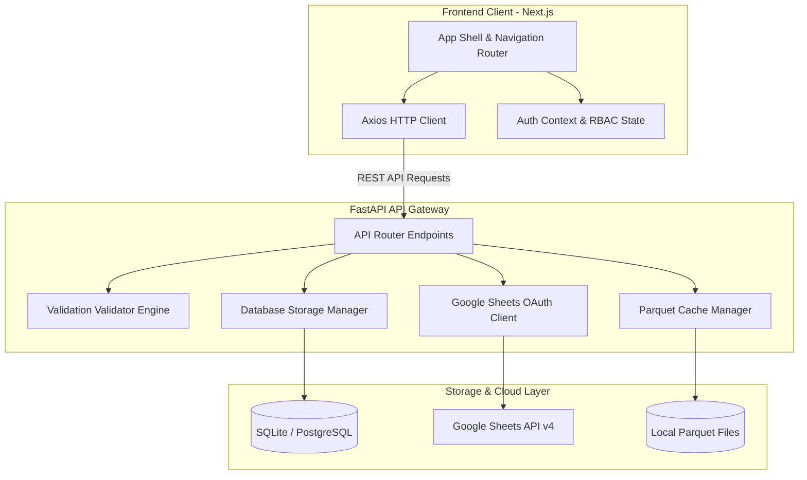
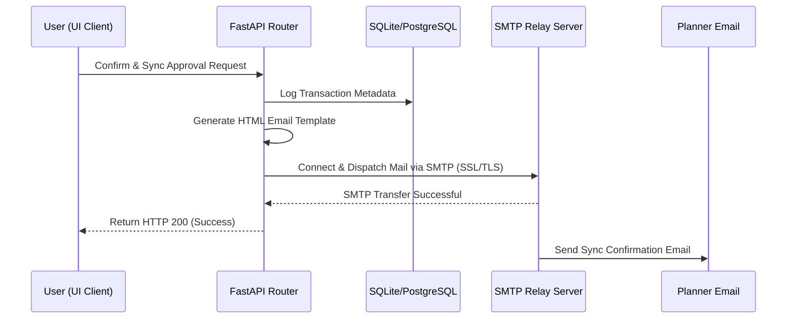

# Demand Planning & Forecast Pipeline Suite: Complete System Guide

This handbook is the single source of truth for the **Demand Planning Suite**. It is designed to onboard new software engineers, assist product managers in coordinating launches, guide business planners in executing forecast cycles, and provide system administrators with deployment details.

---

# PART 1: SYSTEM ARCHITECTURE & DATA FLOWS

This section explains the technical design of the system, data flows, and performance optimization mechanics.

## 1. System Topology & Data Exchange Architecture
The Demand Planning Suite uses a decoupled, high-throughput model designed to handle large-scale database operations and live synchronization with Google Sheets:



* **Frontend**: Next.js App Router, TypeScript, and Vanilla Tailwind CSS. It uses page pre-fetching to ensure instantaneous transitions between views.
* **Backend**: FastAPI (Python), SQLAlchemy, Pandas, and PyArrow. It exposes REST endpoints, runs validation rules, and manages asynchronous background tasks.
* **Database**: Local SQLite for development and PostgreSQL for production. It records sync metadata and execution logs.
* **External Integration**: Google Sheets API v4 (using `gspread` service accounts) serves as the planning database.

---

## 2. High-Performance Caching Layer (Parquet Cache Engine)
To maintain sub-second page loads, the system avoids querying Google Sheets on every page reload by using an optimized local Parquet cache:

* **Caching Reads**: Worksheets are saved locally as `.parquet` files under the backend's outputs directory. The backend reads from these local files, returning data in **less than 100ms**.
* **Automatic Expiry (TTL)**: Cache files expire after a set time limit (e.g. 30 minutes for master data, 5 minutes for parameters). When expired, the next read triggers a fresh fetch from Google Sheets and rebuilds the Parquet file.
* **Asynchronous Cache Warmups**: When write actions are committed (e.g. confirming a Hub Launch sync to the `P-H Master` sheet), the local cache immediately becomes stale. The backend appends the rows to Google Sheets, resolves the user request instantly, and triggers a **detached background thread** to load the fresh sheet and rebuild the Parquet cache file in the background.

---

## 3. Automated Email Trigger Workflows
When a critical pipeline stage finishes (such as baseline approvals or product launch sync confirmations), the system triggers automated notification emails:



* **Configuration**: Credentials (`FROM_EMAIL`, `FROM_EMAIL_APP_PASSWORD`) are loaded securely from environment variables.
* **Template Rendering**: Uses dynamic HTML templates displaying statistics (new rows, skipped records, timestamps).
* **Delivery**: Dispatched via standard SMTP over secure ports (e.g., port 465 or 587).

---

# PART 2: PLATFORM OPERATIONS & RUNBOOK

This section provides page-by-page operational instructions for team members using the application.

## 1. User Roles & Permission Matrix
The system uses Role-Based Access Control (RBAC) to restrict action permissions depending on user profiles:

* **Administrator (`admin`)**: Can execute manual and autopilot baseline pipelines, modify settings, manage users, and confirm master spreadsheet syncs.
* **Planner (`planner`)**: Can run autopilot scripts, execute manual baseline steps 1-5, review forecasts, and confirm new Hub launches.
* **Product Manager (`product`)**: Access is restricted to the **Product Launch (NPL)** module. Can fetch, preview, and sync new product configurations. All baseline operations are locked.
* **Viewer (`viewer`)**: Read-only access across the Dashboard, Master Data, and Final Plan pages. All write, update, and sync confirmation buttons are disabled.

---

## 2. Page-by-Page Operational Guide

### 📊 Dashboard
* **Target Audience**: Planners, Managers, Admins, Viewers.
* **Purpose**: Overview of the forecasting pipeline.
* **Inputs**: Reads system metadata and execution logs from the database.
* **Outputs**: Displays active sync status, data load KPI graphs, and execution history. Check this page to verify that background automation runs completed successfully.

### ⚡ Auto-Pilot
* **Target Audience**: Planners, Admins.
* **Purpose**: Run the end-to-end forecasting pipeline with a single click.
* **Inputs**: Google Sheets configuration parameters.
* **Outputs**: Updated baseline forecast values written to database tables.
* **How to use**:
  1. Click the **Run Auto-Pilot** button.
  2. The system sequentially executes data loading, parameter configuration, baseline generation, validation checks, and spreadsheet syncs.
  3. A live log window displays execution progress.

### ⚙️ Manual Baseline steps (1 → 5)
Planners can execute baseline steps individually for granular control:

* **Step 1: Load Raw Data**:
  * **Inputs**: Sales history database.
  * **Outputs**: Raw baseline dataset.
  * **Action**: Click *Load Raw Data* to fetch historical actuals.
* **Step 2: Configure Parameters**:
  * **Inputs**: Override spreadsheets (growth, seasonality).
  * **Outputs**: Configured baseline parameters.
  * **Action**: Review overrides and click *Confirm Parameters*.
* **Step 3: Generate Baseline**:
  * **Inputs**: Historical data and configuration parameters.
  * **Outputs**: Statistical forecast projection database.
  * **Action**: Click *Generate Forecast* and wait for execution logs.
* **Step 4: Review & Validate**:
  * **Inputs**: Generated forecast projections.
  * **Outputs**: Validation report flags.
  * **Action**: Review flagged items and confirm data integrity.
* **Step 5: Approve Baseline**:
  * **Inputs**: Confirmed forecast projections.
  * **Outputs**: Promoted baseline database records.
  * **Action**: Click *Approve and Promote* to unlock the **Final Plan** tab.

### 📦 Product Launch (NPL)
* **Target Audience**: Admins, Planners, Product Managers.
* **Purpose**: Launch new SKUs by cloning reference parameters from templates to target cities.
* **Inputs**: Template mappings configured in the NPL configuration Google Sheet.
* **Outputs**: New configuration rows appended to the `P-H Master` sheet.
* **How to use**:
  1. Add template rows and target cities to the NPL configuration Google Sheet.
  2. In the UI, click **Fetch & Validate Product Mappings**.
  3. Review the preview table for anomalies or duplicate warnings.
  4. Click **Confirm & Sync to Master** to append configurations.

### 🔌 Hub Launch
* **Target Audience**: Admins, Planners.
* **Purpose**: Configure newly launched distribution hubs by cloning product settings from existing reference hubs.
* **Inputs**: Target hub codes and source reference codes configured in the **FF Input** tab of the Hub Launch spreadsheet.
* **Outputs**: Cloned forecast parameters appended to the `P-H Master` sheet.
* **How to use**:
  1. Add target hub codes and source reference codes to the **FF Input** tab of the Hub Launch spreadsheet.
  2. Click **Fetch & Preview Sync Mappings** in the UI.
  3. The page displays the **Rows to Sync** count, **Duplicates Skipped** count, and a list of validation warnings (e.g. *Hub Mapping missing row for new hub 'Test'*).
  4. Even if warnings exist, you can proceed with the valid rows. The **Confirm & Sync Hubs** button remains active.
  5. Click **Confirm & Sync Hubs** to write the configuration to `P-H Master`. The backend will refresh the caches in the background.

### 📋 Final Plan
* **Target Audience**: Admins, Planners.
* **Purpose**: Displays final forecasting reports. Locked until the active baseline is approved in step 5.
* **Inputs**: Approved baseline projections.
* **Outputs**: Read-only validation summaries and CSV export configurations.

### ⚙️ Settings
* **Target Audience**: All Roles.
* **Purpose**: Configuration profiles manager.
* **Inputs**: User input settings overrides (e.g. passwords, email address, API paths).
* **Outputs**: Updated configuration profile records.

---

# PART 3: LOCAL DEVELOPMENT & TESTING

Follow these steps to run and test the application on your local machine.

## 1. Backend Setup
1. Navigate to the backend directory:
   ```bash
   cd backend
   ```
2. Create and activate a Python virtual environment:
   ```bash
   python -m venv venv
   # On Windows:
   venv\Scripts\activate
   # On macOS/Linux:
   source venv/bin/activate
   ```
3. Install dependencies:
   ```bash
   pip install -r requirements.txt
   ```
4. Create a `.env` file in the `backend` folder:
   ```env
   DATABASE_URL=sqlite:///forecasting_db.sqlite
   GOOGLE_CREDENTIALS_JSON={"type": "service_account", ...}
   NEW_HUB_LAUNCH_SHEET_URL=https://docs.google.com/spreadsheets/d/1ZraxKQ-oJPrIablGSaMffTBQiJSx9us7omj8yG3etVM/edit
   ```
5. Run the development server:
   ```bash
   uvicorn app.main:app --reload --port 8000
   ```

## 2. Frontend Setup
1. Navigate to the frontend directory:
   ```bash
   cd frontend
   ```
2. Install npm dependencies:
   ```bash
   npm install
   ```
3. Create a `.env.local` file:
   ```env
   NEXT_PUBLIC_API_URL=http://localhost:8000
   ```
4. Start the Next.js development server:
   ```bash
   npm run dev
   ```
5. Open [http://localhost:3000](http://localhost:3000) in your browser.

## 3. Run Sync Simulations Locally
To test the preview parser and check validation rules offline:
```bash
$env:PYTHONPATH="src"
python scratch/inspect_new_hub_preview.py
```
This saves the preview results directly to `scratch/preview_output.json`.
