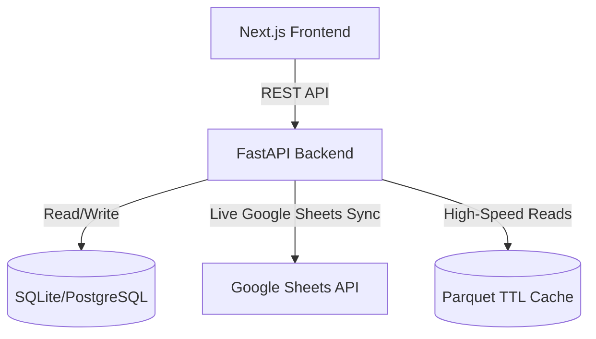

# Demand Planning Suite: Operations & Engineering Playbook

Welcome to the comprehensive, developer-grade **Operations & Engineering Playbook** for the **Demand Planning Suite**. This guide outlines system topology, core workflows, user role permissions, and page-by-page operational instructions.

---

## 1. System Architecture & Caching Topology

The architecture leverages a high-performance web application pattern to interface with heavy analytical databases and live Google Sheets documents.



### Parquet Caching Mechanism
To eliminate Sheets API latency (which can reach 40+ seconds for sheets containing 113,000+ records), the system serializes sheets into optimized local Parquet file directories:
* **Lookup Path**: Checks cached data in `backend/outputs/` directory.
* **Cached Reads**: Serves reads within milliseconds if the cache is fresh.
* **Asynchronous Warmups**: Upon triggering confirm endpoints, the backend spawns a detached execution thread to query fresh sheet updates from the API, overwrite the local Parquet files, and warm up caches asynchronously without blocking user request resolution.

---

## 2. User Roles & Access Control Matrix

The suite enforces role-based access control (RBAC). Roles are configured inside your profile database settings:

| Role | Navigation Pages Accessible | Write/Sync Permission |
| :--- | :--- | :--- |
| **Administrator** | All Pages | Yes (Can execute baselines, sync master tables, configure pipelines) |
| **Planner** | Dashboard, Auto-Pilot, Baseline 1-5, Master Data, Hub Launch, Final Plan | Yes (Can run pipelines and update forecast matrices) |
| **Product** | Dashboard, Product Launch, Settings | Yes (Limited to launching new products & template cloning) |
| **Viewer** | Dashboard, Master Data, Settings, About | No (Read-Only preview access) |

---

## 3. Sidebar Page-by-Page Operational Guide

### 📂 Dashboard
* **Roles**: Administrator, Planner, Viewer, Product.
* **Functionality**:
  * Shows pipeline sync statuses, forecasting metrics summary, and active job notifications.
  * Allows downloading diagnostic summaries.

### ⚡ Auto-Pilot
* **Roles**: Administrator, Planner.
* **Functionality**:
  * Trigger a fully automated end-to-end pipeline sync run (runs all baseline generation tasks, validations, and exports sequentially in one click).

### ⚙️ Manual Baseline Steps (1 → 5)
Follow these sub-navigation steps sequentially for manual baseline generation runs:

#### 1. Load Raw Data
* **Purpose**: Fetches fresh weekly historical sales actuals from the database and constructs the baseline starting point.
* **Action**: Click *Load Raw Data* and monitor the terminal log overlay.

#### 2. Configure Parameters
* **Purpose**: Syncs parameters (growth rate overrides, seasonality overrides) from master spreadsheets.
* **Action**: Review mapped values and confirm configuration overrides.

#### 3. Generate Baseline
* **Purpose**: Runs the statistical forecasting algorithm models.
* **Action**: Trigger run and wait for processing logs to complete.

#### 4. Review & Validate
* **Purpose**: Inspect outliers, negative baseline errors, or massive sales swings.
* **Action**: View validation tables, flag rows for corrections, or proceed.

#### 5. Approve Baseline
* **Purpose**: Promotes the generated baseline to production. Once approved, it unlocks access to the **Final Plan** tab.

### 📦 Product Launch (NPL)
* **Roles**: Administrator, Planner, Product.
* **Functionality**:
  * Launch new product configurations by cloning reference parameters from a templates product to target cities.
  * Displays warning logs, already-existing flags, and total insert metrics.
  * Actions include **Fetch & Validate Product Mappings** followed by **Confirm & Sync to Master**.

### 🔌 Hub Launch
* **Roles**: Administrator, Planner.
* **Functionality**:
  * Setup target launched distribution centers using existing source reference hubs.
  * **Fetch & Preview Mappings**: Queries parameters dynamically from the `FF Input` tab on the Hub Launch configuration spreadsheet.
  * **Validations Grid**: Verifies if destination hubs exist in the `Hub Mapping` configurations. If validation fails, it lists warnings (e.g., *Hub Mapping missing row for new hub 'Test'*).
  * **Confirm & Sync Hubs**: Appends configuration rows directly to `P-H Master` sheet. Enabled for partial syncs even if warnings are present on other rows.

### 📋 Final Plan
* **Roles**: Administrator, Planner.
* **Functionality**:
  * Exposes the final consolidated forecast plan. This remains locked until step 5 (Approve Baseline) has been confirmed.

### ⚙️ Settings
* **Roles**: All Roles.
* **Functionality**:
  * Update profile settings, change database connections, and view API endpoints paths.

---

## 4. Local Installation & Deployment Guidelines

### A. Environment Configuration (.env)
Create a `.env` file under the `backend/` directory:
```env
# Backend Server
DATABASE_URL=sqlite:///forecasting_db.sqlite
GOOGLE_CREDENTIALS_JSON={"type": "service_account", ...}
NEW_HUB_LAUNCH_SHEET_URL=https://docs.google.com/spreadsheets/d/1ZraxKQ-oJPrIablGSaMffTBQiJSx9us7omj8yG3etVM/edit?usp=sharing
```

### B. Deployment & Production Setup
1. **Frontend (Vercel)**:
   * Build command: `npm run build`
   * Environment variable required: `NEXT_PUBLIC_API_URL` pointing to backend host.
2. **Backend (Docker & Hugging Face Spaces)**:
   * Build container: `docker build -t forecast-backend -f Dockerfile .`
   * Deployment: Direct push triggers on `git push hf main` rebuild the server.
