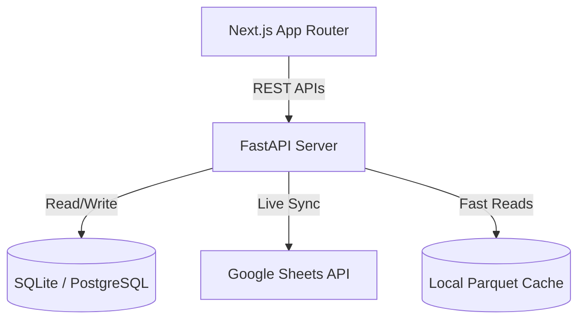

# Demand Planning Suite: Core Engineering & Architecture Guide

Welcome to the Developer & Architecture Guide for the **Demand Planning Suite**. This documentation outlines the system design, core features (New Product Launch, Hub Launch), caching layer optimizations, local replication procedures, and cloud deployment flows.

---

## 1. System Architecture Overview

The system is split into a decoupled modern web application structure:
* **Frontend**: Next.js (App Router), TypeScript, and Tailwind CSS.
* **Backend**: FastAPI (Python), SQLAlchemy, and PostgreSQL/SQLite.
* **Data Sources**: Real-time integration with Google Sheets API (v4) using `gspread` and oauth service account credentials.



---

## 2. Core Functional Modules

### A. New Product Launch (NPL)
* **Objective**: Automate launching new SKUs by cloning reference parameters from a template product to selected target cities and launching hubs.
* **Parameters Source**: Loads configurations from the `NPL` configuration Google Sheet.
* **Pipeline Integration**: Recomputes forecasting parameters (DOC values, price metrics, inventory flags) and syncs rows to the master database and `P-H Master` sheets.

### B. New Hub Launch
* **Objective**: Automatically create configuration mappings for newly launched distribution centers.
* **Input Sheet**: Configured in the `FF Input` tab of the Hub Launch spreadsheet.
* **Workflow**:
  1. **Fetch Preview**: Reads mapping rows (Target Hub vs. Reference Source Hub).
  2. **Validation**: Checks if destination hub rows are configured in the `Hub Mapping` configuration tab.
  3. **Diff Check**: Discards duplicate rows already synced.
  4. **Cloning**: Clones all product metrics from the reference source hub, applies target hub details (name, coordinates, region, tier), and prepares the append matrix.
  5. **Confirm Sync**: Writes the new rows to the destination `P-H Master` sheet.

---

## 3. High-Performance Caching Layer (Parquet-backed TTL Cache)

To resolve API latency issues with Google Sheets, the system implements a **Local TTL Parquet Caching Layer**:

* **How it works**:
  * Instead of querying Google Sheets API on every page reload, data is serialized into local `.parquet` files under the backend's runtime output directory.
  * Reads look up the local file first. If the file is within its TTL (e.g., 30 minutes for Master data, 5 minutes for logs), it loads the dataframe **instantly (< 100ms)**.
* **Cache Invalidation & Background Warmups**:
  * After committing insertions/syncs (e.g., adding rows to `P-H Master`), the cache becomes stale.
  * The backend triggers an **asynchronous background thread** to fetch a fresh copy of the sheet from Google API, compute clean data, and overwrite the local Parquet cache without blocking the user response.

---

## 4. Local Development Setup

Follow these instructions to run the entire stack locally:

### A. Backend Setup
1. Navigate to the backend directory:
   ```bash
   cd backend
   ```
2. Create and activate a Python virtual environment:
   ```bash
   python -m venv venv
   venv\Scripts\activate   # On Windows
   source venv/bin/activate # On Unix
   ```
3. Install dependencies:
   ```bash
   pip install -r requirements.txt
   ```
4. Create a `.env` file inside the `backend` folder matching the template below:
   ```env
   DATABASE_URL=sqlite:///forecasting_db.sqlite
   GOOGLE_CREDENTIALS_JSON={"type": "service_account", ...}
   NEW_HUB_LAUNCH_SHEET_URL=https://docs.google.com/spreadsheets/d/1ZraxKQ-oJPrIablGSaMffTBQiJSx9us7omj8yG3etVM/edit
   ```
5. Run the FastAPI development server:
   ```bash
   uvicorn app.main:app --reload --port 8000
   ```

### B. Frontend Setup
1. Navigate to the frontend directory:
   ```bash
   cd ../frontend
   ```
2. Install npm dependencies:
   ```bash
   npm install
   ```
3. Create a `.env.local` configuration:
   ```env
   NEXT_PUBLIC_API_URL=http://localhost:8000
   ```
4. Run the Next.js development server:
   ```bash
   npm run dev
   ```
5. Open [http://localhost:3000](http://localhost:3000) in your browser.

---

## 5. CI/CD & Deployment Architecture

The suite uses a dual-deployment model optimized for rapid iteration:

### A. Frontend (Vercel)
* **Framework**: Next.js App Router.
* **Build Command**: `npm run build`
* **Output**: Fully static/dynamic pages deployed to edge servers globally.

### B. Backend (Hugging Face Spaces)
* **Platform**: Spaces running Docker container deployments.
* **CI/CD Triggers**: Pushes to `hf/main` trigger Docker image rebuilds and deployment rollouts automatically.
* **Process Manager**: Uvicorn server processes requests inside Docker.

---

## 6. How to Test Changes Locally
To verify sheet reading and sync calculations without deploying:
1. Make changes to the `FF Input` spreadsheet tab.
2. Run the local preview inspection script:
   ```bash
   $env:PYTHONPATH="src"
   python scratch/inspect_new_hub_preview.py
   ```
3. Inspect `scratch/preview_output.json` to verify calculated preview outputs and validation status codes.
