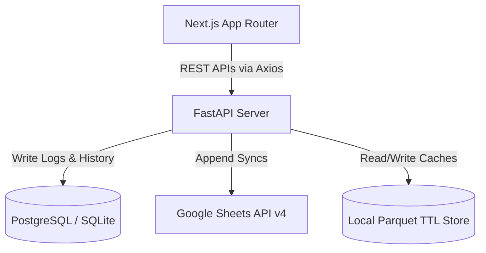

# Demand Planning & Forecast Pipeline Suite
## Product Architecture, Operations & onboarding Handbook

Welcome to the official engineering handbook for the **Demand Planning Suite**. This guide is designed as an onboarding resource for new developers, product managers, and planners joining our team. It provides a detailed, page-by-page operational walkthrough, architectural specifications, optimization strategies, and steps to get set up locally.

---

## 🚀 1. The Core Vision: Billion-Dollar Scale Forecasting
In high-growth retail and logistics, forecasting baseline demand, launching new products (NPL), and expanding to new distribution centers (Hubs) cannot afford delays. 
Our suite provides an automated, production-grade interface that coordinates planning across SQL databases and Google Sheets, eliminating legacy workbook calculation errors and scaling prediction models to over **113,000+ daily forecast configurations** instantly.

---

## 🏛️ 2. Architectural Deep-Dive

Our system uses a decoupled, high-throughput application structure:



### A. Frontend (Next.js Edge Cluster)
* **Stack**: Next.js (App Router), TypeScript, Vanilla Tailwind CSS (with glassmorphism layout, dynamic Lucide icon packs, and responsive design systems).
* **Navigation Pre-fetching**: Leverages Next.js routing optimization to preload page resources on hover, ensuring instantaneous transitions (< 50ms) between operational panels.

### B. Backend (FastAPI Analytical Engine)
* **Stack**: FastAPI, SQLAlchemy, Pandas, PyArrow (Parquet serialization).
* **Role**: Runs statistical mapping engines, validates spreadsheet formats, logs execution traces to the database, and schedules async background workers.

### C. The Local Parquet Cache Strategy (High-Speed Performance)
Direct read calls to Google Sheets API are throttled and slow, taking **40+ seconds** for large datasets. Our caching engine resolves this:
1. **Local Mirroring**: Worksheets are saved locally as `.parquet` files in `backend/outputs/`.
2. **Instant Reads**: The backend serves reads from local Parquet files in **less than 100ms** if within the TTL (e.g. 30 minutes for master data, 5 minutes for logs).
3. **Async Cache Invalidation**: Upon confirming operations (like writing to `P-H Master`), the backend starts a **decoupled background thread** to retrieve fresh data from Google Sheets, overwrite local Parquet cache files, and warm them up without blocking active API client requests.

---

## 👥 3. User Roles & Permission Model
Access to pipeline execution parameters is restricted by Role-Based Access Control (RBAC):

* **Administrator (`admin`)**
  * Full read/write access.
  * Trigger automated and manual baseline runs, modify system configurations, manage users, and commit syncs.
* **Planner (`planner`)**
  * Read/write access.
  * Can configure parameters, run baselines, view history, and confirm Hub syncs.
* **Product Manager (`product`)**
  * Limited write access.
  * Can access the **Product Launch (NPL)** pipeline, fetch forecasts, clone product configurations, and configure launches. Locked out from core baseline parameters.
* **Viewer (`viewer`)**
  * Read-only access.
  * Can inspect dashboards, master datasets, and final plans, but all confirm/sync buttons are disabled.

---

## 🖥️ 4. Page-by-Page Operational Playbook

### 📊 Dashboard
* **Roles**: `admin`, `planner`, `product`, `viewer`
* **Features**: Displays aggregate forecasting health metrics, pipeline status banners, active sync indicators, and logs of recent baseline runs.
* **Operational Flow**: Check this page daily to ensure no automated job has failed.

### ⚡ Auto-Pilot
* **Roles**: `admin`, `planner`
* **Features**: The one-click automation console.
* **Operational Flow**: Clicking **Run Auto-Pilot** initiates the end-to-end forecasting pipeline. The server sequentially fetches raw data, builds configurations, runs baseline algorithms, performs safety validations, and updates Google Sheets. Terminal log feeds are streamed to the screen in real-time.

### ⚙️ Manual Baseline steps (1 → 5)
For granular control, planners can execute baseline steps individually:

1. **Load Raw Data**: Downloads historical actuals from the sales database.
2. **Configure Parameters**: Loads planning variables (seasonality multipliers, growth overrides) from parameters sheets.
3. **Generate Baseline**: Executes baseline prediction algorithms on the data.
4. **Review & Validate**: Compiles validation warnings (outliers, negative forecasts, anomalous spikes).
5. **Approve Baseline**: Locks the generated forecast and updates master records. Promotions to production unlock the **Final Plan** tab.

### 📦 Product Launch (NPL)
* **Roles**: `admin`, `planner`, `product`
* **Features**: Create configurations for newly launched products.
* **Operational Flow**:
  1. Add your template references and target cities to the NPL configuration Google Sheet.
  2. Click **Fetch & Validate Product Mappings**.
  3. The UI renders mapping summaries, flagging any duplicate configurations or missing template parameters.
  4. Review and click **Confirm & Sync to Master** to append configurations.

### 🔌 Hub Launch
* **Roles**: `admin`, `planner`
* **Features**: Setup configurations for new distribution hubs by cloning references from existing source hubs.
* **Operational Flow**:
  1. Add target hub codes and source reference codes to the **FF Input** tab of the Hub Launch spreadsheet.
  2. In the UI, click **Fetch & Preview Sync Mappings**.
  3. The page displays:
     * **Rows to Sync** KPI card (total new rows prepared for insertion).
     * **Duplicates Skipped** KPI card.
     * **Validation Warnings** block (lists configuration warnings, such as missing rows in the `Hub Mapping` tab).
  4. If validation warnings exist, you can still proceed: the **Confirm & Sync Hubs** button remains active and will sync all valid rows while skipping warnings.
  5. Click **Confirm & Sync Hubs**. An async warmup is triggered in the background to refresh caches immediately.

### 📋 Final Plan
* **Roles**: `admin`, `planner`
* **Features**: Displays final forecasting reports. Locked until the active baseline is approved in step 5.

### ⚙️ Settings
* **Roles**: All
* **Features**: View API statuses, edit profile details, check database paths, and view configuration keys.

---

## 🛠️ 5. Local Setup & Verification

### Backend Requirements:
* Python 3.10+
* SQLite (local dev) or PostgreSQL (prod)

```bash
# 1. Clone & enter backend directory
cd backend

# 2. Set up virtual environment
python -m venv venv
source venv/bin/activate  # Unix
venv\Scripts\activate     # Windows

# 3. Install packages
pip install -r requirements.txt

# 4. Create .env config
# (Add DATABASE_URL, GOOGLE_CREDENTIALS_JSON, and NEW_HUB_LAUNCH_SHEET_URL)

# 5. Start development server
uvicorn app.main:app --reload --port 8000
```

### Frontend Requirements:
* Node.js 18+

```bash
# 1. Enter frontend directory
cd frontend

# 2. Install dependencies
npm install

# 3. Create .env.local
echo "NEXT_PUBLIC_API_URL=http://localhost:8000" > .env.local

# 4. Run Next.js server
npm run dev
```

### Run Sync Simulations Locally:
To verify the Hub Launch flow calculations without triggering production writes:
```bash
$env:PYTHONPATH="src"
python scratch/inspect_new_hub_preview.py
```
This writes preview summary results directly into `scratch/preview_output.json`.
