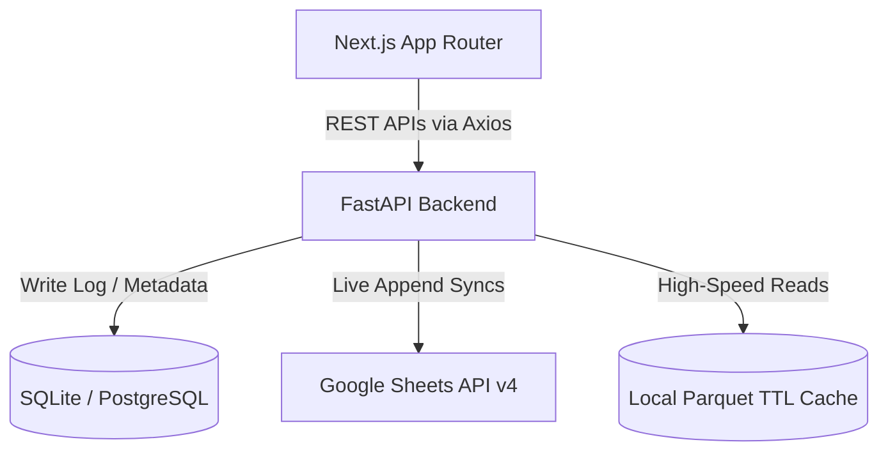

# Demand Planning & Forecast Pipeline Suite: System Architecture & Operations Manual

This guide serves as the single source of truth for the **Demand Planning Suite**. It is structured to help software engineers, product managers, business planners, and operations leads understand both the high-level architecture and page-by-page functionality of the platform.

---

# PART 1: SYSTEM ARCHITECTURE & TECHNICAL DESIGN

This section explains the technical design of the system, data flows, and performance optimization mechanics.

## 1. High-Level Architecture Topology
The Demand Planning Suite uses a decoupled, high-performance web structure built to support heavy analytical queries and real-time edits to Google Sheets:



* **Frontend**: Built with **Next.js (App Router)** and TypeScript. It features a light glassmorphic Tailwind interface, Lucide icon sets, dynamic KPI card animations, and navigation pre-fetching for instant page load transitions.
* **Backend**: Built with **FastAPI (Python)**, SQLAlchemy, Pandas, and PyArrow. It exposes REST APIs for sync controls, computes configurations cloning, runs validation rules, and handles asynchronous queue tasks.
* **Data Layer**: Historical records and sync logs are kept in SQLite (development) or PostgreSQL (production). Target forecast configurations are synced directly to Google Sheets worksheets.

---

## 2. High-Performance Caching Layer (Parquet Cache Engine)
Querying 100,000+ rows directly from the Google Sheets API on every page reload causes timeouts and slow response times (often exceeding 45 seconds). To maintain **sub-second page loads**, the system uses an optimized local Parquet cache:

* **Caching Reads**: Worksheet configurations are stored locally inside the backend runtime outputs as `.parquet` files. When a user requests data, the backend reads from these local files, returning data in **less than 100ms**.
* **Automatic Expiry (TTL)**: Cache files expire after a set time limit (e.g., 30 minutes for master data, 5 minutes for parameters). When expired, the next read triggers a fresh fetch from Google Sheets and rebuilds the Parquet file.
* **Asynchronous Cache Warmups**: When write actions are committed (e.g. confirming a Hub Launch sync to the `P-H Master` sheet), the local cache immediately becomes stale. The backend appends the rows to Google Sheets, resolves the user request instantly, and triggers a **detached background thread** to load the fresh sheet and rebuild the Parquet cache file in the background.

---

# PART 2: PLATFORM OPERATIONS & RUNBOOK

This section provides page-by-page operational instructions for team members using the application.

## 1. User Roles & Permission Matrix
The system uses Role-Based Access Control (RBAC) to restrict action permissions depending on user profiles:

* **Administrator (`admin`)**: Can execute manual and autopilot baseline pipelines, modify settings, manage users, and confirm master spreadsheet syncs.
* **Planner (`planner`)**: Can run autopilot scripts, execute manual baseline steps 1-5, review forecasts, and confirm new Hub launches.
* **Product Manager (`product`)**: Access is restricted to the **Product Launch (NPL)** module. Can fetch, preview, and sync new product configurations. All baseline operations are locked.
* **Viewer (`viewer`)**: Read-only access across the Dashboard, Master Data, and Final Plan pages. All write, update, and sync confirmation buttons are disabled.

---

## 2. Page-by-Page Operational Guide

### 📊 Dashboard
* **Target Audience**: Planners, Managers, Admins, Viewers.
* **Purpose**: Overview of the forecasting pipeline.
* **How to use**: Displays active sync status, data load KPI graphs, and execution history. Check this page to verify that background automation runs completed successfully.

### ⚡ Auto-Pilot
* **Target Audience**: Planners, Admins.
* **Purpose**: Run the end-to-end forecasting pipeline with a single click.
* **How to use**:
  1. Click the **Run Auto-Pilot** button.
  2. The system sequentially executes data loading, parameter configuration, baseline generation, validation checks, and spreadsheet syncs.
  3. A live log window displays execution progress.

### ⚙️ Manual Baseline steps (1 → 5)
Planners can execute baseline steps individually for granular control:

* **Step 1: Load Raw Data**: Fetches weekly actuals from databases to establish baseline starter sets.
* **Step 2: Configure Parameters**: Loads multipliers and growth parameters from override sheets.
* **Step 3: Generate Baseline**: Runs forecasting algorithms on historical data.
* **Step 4: Review & Validate**: Shows anomalies, negative forecasts, or huge sales swings.
* **Step 5: Approve Baseline**: Locks the active baseline and promotes the forecast to production. This unlocks access to the **Final Plan** tab.

### 📦 Product Launch (NPL)
* **Target Audience**: Admins, Planners, Product Managers.
* **Purpose**: Launch new SKUs by cloning reference parameters from templates to target cities.
* **How to use**:
  1. Add template rows and target cities to the NPL configuration Google Sheet.
  2. In the UI, click **Fetch & Validate Product Mappings**.
  3. Review the preview table for anomalies or duplicate warnings.
  4. Click **Confirm & Sync to Master** to append configurations.

### 🔌 Hub Launch
* **Target Audience**: Admins, Planners.
* **Purpose**: Configure newly launched distribution hubs by cloning product settings from existing reference hubs.
* **How to use**:
  1. Add target hub codes and source reference codes to the **FF Input** tab of the Hub Launch spreadsheet.
  2. Click **Fetch & Preview Sync Mappings** in the UI.
  3. The page displays the **Rows to Sync** count, **Duplicates Skipped** count, and a list of validation warnings (e.g. *Hub Mapping missing row for new hub 'Test'*).
  4. Even if warnings exist, you can proceed with the valid rows. The **Confirm & Sync Hubs** button remains active.
  5. Click **Confirm & Sync Hubs** to write the configuration to `P-H Master`. The backend will refresh the caches in the background.

---

# PART 3: LOCAL DEVELOPMENT & TESTING

Follow these steps to run and test the application on your local machine.

## 1. Backend Setup
1. Navigate to the backend directory:
   ```bash
   cd backend
   ```
2. Create and activate a Python virtual environment:
   ```bash
   python -m venv venv
   # On Windows:
   venv\Scripts\activate
   # On macOS/Linux:
   source venv/bin/activate
   ```
3. Install dependencies:
   ```bash
   pip install -r requirements.txt
   ```
4. Create a `.env` file in the `backend` folder:
   ```env
   DATABASE_URL=sqlite:///forecasting_db.sqlite
   GOOGLE_CREDENTIALS_JSON={"type": "service_account", ...}
   NEW_HUB_LAUNCH_SHEET_URL=https://docs.google.com/spreadsheets/d/1ZraxKQ-oJPrIablGSaMffTBQiJSx9us7omj8yG3etVM/edit
   ```
5. Run the development server:
   ```bash
   uvicorn app.main:app --reload --port 8000
   ```

## 2. Frontend Setup
1. Navigate to the frontend directory:
   ```bash
   cd frontend
   ```
2. Install npm dependencies:
   ```bash
   npm install
   ```
3. Create a `.env.local` file:
   ```env
   NEXT_PUBLIC_API_URL=http://localhost:8000
   ```
4. Start the Next.js development server:
   ```bash
   npm run dev
   ```
5. Open [http://localhost:3000](http://localhost:3000) in your browser.

## 3. Run Sync Simulations Locally
To test the preview parser and check validation rules offline:
```bash
$env:PYTHONPATH="src"
python scratch/inspect_new_hub_preview.py
```
This saves the preview results directly to `scratch/preview_output.json`.
